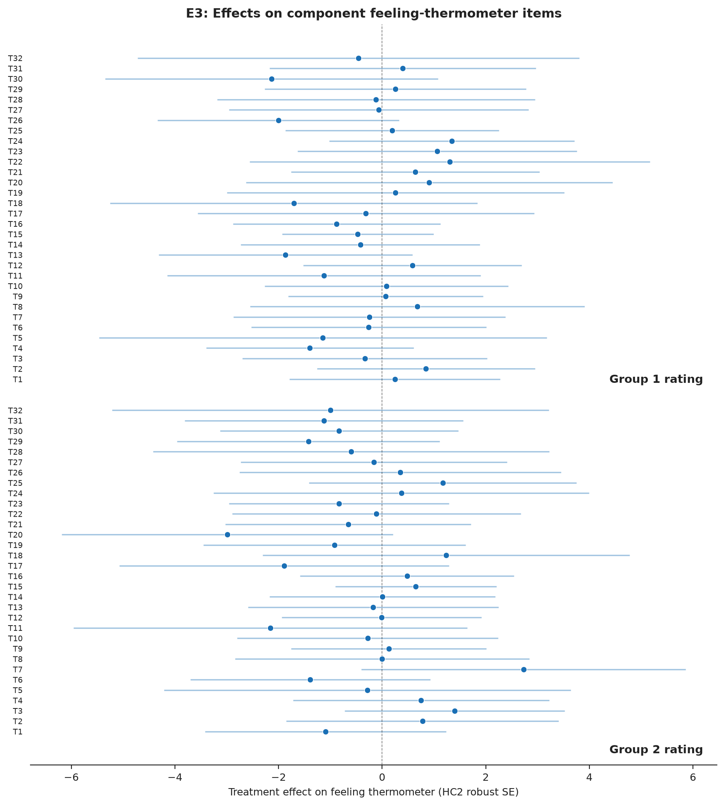

# Testing 33 Student-Designed Interventions to Reduce Affective Polarization

*Yamil Velez | 2026-10-01 | N = 4,913 analysed of 6,086 collected | survey experiment*

> **Provenance: FULLY AGENTIC — no human review recorded.** Generated by filedrawer 0.1.0 on 2026-10-01 with openrouter (orchestrator `anthropic/claude-sonnet-5.5`, standard `qwen/qwen3.8-27b`, zero data retention requested). Reviewer pass: no. Human steps recorded: 0. Release status: released.
>
> **No pre-registration. The analysis plan was reconstructed after data collection (2026-10-01) from the original analysis script.** Every test below is post hoc or exploratory.

## Key findings

- Pooled across 32 arms, affective polarization fell 1.0 points (95% CI [−1.6, −0.3], p = 0.004), but no single arm reached conventional significance on a two-sided test.
- Common-ground articles and the 'What makes an American' video each reduced affective polarization by roughly 3–4 points; both were significant one-sided (p = 0.044) but not two-sided (p ≈ 0.09).
- No intervention produced a detectable change in support for undemocratic practices (pooled p = 0.912).
- Among Democrats only, the 'What makes an American' video reduced affective polarization by 4.0 points (p = 0.035); no arm was significant among Republicans.
- All 32 arm-level tests are post hoc and uncorrected for multiplicity; several arms have fewer than 60 respondents.

## Summary

We tested 32 student-designed interventions against a pure control in a US online panel experiment (N = 4,913; control n = 187). The primary outcome was affective polarization measured by a feeling-thermometer difference; the secondary outcome was support for undemocratic practices. Pooled across all arms, affective polarization was 1.0 points lower than control (95% CI [−1.6, −0.3], p = 0.004), indicating a small average effect. No single arm reached two-sided significance at the 0.05 level, though Common-ground articles (−3.8 points, 95% CI [−8.2, 0.6]) and the 'What makes an American' video (−2.7 points, 95% CI [−5.9, 0.4]) were significant on a one-sided test (p = 0.044 each). Support for undemocratic practices showed no detectable change in any arm or in the pooled estimate (p = 0.912). The study was not pre-registered; all tests are post hoc and uncorrected for multiplicity.

## Design and data

Design: survey experiment. Arms: `arm`: 32 treatment arms (T1 = Cooperation infographic, T2 = Bipartisan bills graph, T3 = Bipartisan elite quotes, T4 = Shared values exercise, T5 = Cross-partisan dialogue guide, T6 = Meta-dehumanization correction, T7 = Perception survey (form), T8 = Common-ground articles, T9 = Patriotic article, T10 = 14th Amendment video, T11 = Congressional softball video, T12 = iSideWith quiz, T13 = Rick and Morty perspective-taking, T14 = Brené Brown empathy video, T15 = Perception gap video, T16 = 'What makes an American' video, T17 = McCain defends Obama video, T18 = Egyptian revolution video, T19 = Cross-partisan friendship TED talk, T20 = American history video, T21 = Party-tailored videos, T22 = Jubilee free speech panel, T23 = Jubilee video, T24 = Media-profits-from-division image, T25 = Shared priorities (Pew) table, T26 = Bipartisan legislation examples, T27 = Common threat (Russia), T28 = Pro-democracy excerpt, T29 = Biden–DeSantis cooperation, T30 = Scandals, both parties (labeled), T31 = Scandals (labels revealed later), T32 = Perception gap quiz) vs control T0 = Control. Population: online_panel, US.

Sample: 6,086 raw responses; 4,913 in the analysis sample after exclusions `partisan in ['Democrat','Republican']; arm != 'T33'`.

Analysis plan: author-supplied pap.json; registration: none. Identifier and free-text columns removed before any model saw the data: StartDate, EndDate, RecordedDate.

Six thousand eighty-six respondents were recruited from a US online panel; 4,913 remained after listwise deletion of missing values. The control group contained 187 respondents shared across all 32 treatment arms. Arm sizes ranged from 43 to 530. The GPT-3 chatbot arm (T33) was excluded due to technical failures. The analysis was reconstructed post hoc and was not pre-registered, so every test reported here is exploratory in the strict sense. Models included pre-treatment affective polarization as a covariate and used HC2 standard errors with inverse-probability weights.

## Results

### H1. Affective polarization after treatment

*Each intervention reduces post_ap relative to control.*  
*Post hoc, not pre-registered.*

32 treatment arms are compared with control (Control) in one model on Affective polarization after treatment.


The pooled estimate across 32 arms was −1.0 points on the affective polarization scale (95% CI [−1.6, −0.3], p = 0.004, two-sided), indicating a small but statistically detectable average reduction. No individual arm reached two-sided significance at α = 0.05. Common-ground articles (−3.8 points, 95% CI [−8.2, 0.6], p = 0.089 two-sided; p = 0.044 one-sided) and the 'What makes an American' video (−2.7 points, 95% CI [−5.9, 0.4], p = 0.088 two-sided; p = 0.044 one-sided) were the two largest effects and were significant on a directional test. The remaining 30 arms were within roughly ±3 points of control and not distinguishable from it. Because 32 tests were conducted without multiplicity correction, the two directional hits should be interpreted with caution.

Pooled across 32 arms (random effects): -0.962, SE 0.333, p = 0.004, tau2 = 0.0000, I2 = 0.00. Caveat: the arm effects share one control group, so they are not independent; the random-effects pooling treats them as if they were, and its standard error and heterogeneity statistics are approximate.

```
post_ap ~ C(arm_code, Treatment(reference='T0')) + pre_ap
OLS | weights = ipw_weight | HC2 robust SEs | N = 3186 | negative test, alpha = 0.05
```

| Arm | Estimate | SE | p | 95% CI | n (arm) | Supported |
|---|---|---|---|---|---|---|
| Cooperation infographic | -1.831 | 1.612 | 0.2562 | [-4.990, 1.329] | 79 | no |
| Bipartisan bills graph | -0.232 | 1.799 | 0.8975 | [-3.757, 3.294] | 86 | no |
| Bipartisan elite quotes | -0.141 | 1.677 | 0.9328 | [-3.429, 3.146] | 81 | no |
| Shared values exercise | -1.837 | 1.683 | 0.2752 | [-5.136, 1.462] | 64 | no |
| Cross-partisan dialogue guide | -1.679 | 3.792 | 0.6580 | [-9.112, 5.754] | 57 | no |
| Meta-dehumanization correction | -2.083 | 1.917 | 0.2774 | [-5.841, 1.675] | 185 | no |
| Perception survey (form) | 0.823 | 2.057 | 0.6891 | [-3.209, 4.855] | 71 | no |
| Common-ground articles | -3.794 | 2.229 | 0.0888 | [-8.164, 0.575] | 56 | yes |
| Patriotic article | -0.681 | 1.514 | 0.6528 | [-3.648, 2.286] | 275 | no |
| 14th Amendment video | -1.685 | 1.711 | 0.3249 | [-5.038, 1.669] | 53 | no |
| Congressional softball video | -0.516 | 2.339 | 0.8253 | [-5.101, 4.069] | 53 | no |
| iSideWith quiz | 0.335 | 1.428 | 0.8144 | [-2.464, 3.135] | 60 | no |
| Rick and Morty perspective-taking | -0.975 | 1.785 | 0.5846 | [-4.473, 2.522] | 43 | no |
| Brené Brown empathy video | 1.482 | 1.835 | 0.4194 | [-2.115, 5.078] | 134 | no |
| Perception gap video | -1.382 | 1.166 | 0.2358 | [-3.667, 0.903] | 519 | no |
| 'What makes an American' video | -2.735 | 1.604 | 0.0881 | [-5.879, 0.409] | 129 | yes |
| McCain defends Obama video | -1.145 | 2.984 | 0.7012 | [-6.994, 4.704] | 76 | no |
| Egyptian revolution video | 0.676 | 3.149 | 0.8300 | [-5.495, 6.847] | 56 | no |
| Cross-partisan friendship TED talk | -0.770 | 2.197 | 0.7259 | [-5.076, 3.536] | 66 | no |
| American history video | -0.488 | 2.674 | 0.8553 | [-5.729, 4.754] | 57 | no |
| Party-tailored videos | -0.206 | 1.779 | 0.9077 | [-3.692, 3.280] | 63 | no |
| Jubilee free speech panel | -2.749 | 2.597 | 0.2898 | [-7.838, 2.341] | 39 | no |
| Jubilee video | 0.056 | 2.175 | 0.9795 | [-4.207, 4.318] | 104 | no |
| Media-profits-from-division image | -3.179 | 2.422 | 0.1892 | [-7.926, 1.567] | 87 | no |
| Shared priorities (Pew) table | -0.556 | 1.584 | 0.7254 | [-3.660, 2.548] | 61 | no |
| Bipartisan legislation examples | -1.326 | 1.978 | 0.5027 | [-5.204, 2.552] | 58 | no |
| Common threat (Russia) | -2.398 | 2.026 | 0.2366 | [-6.368, 1.573] | 66 | no |
| Pro-democracy excerpt | -0.531 | 1.889 | 0.7785 | [-4.233, 3.171] | 45 | no |
| Biden–DeSantis cooperation | -0.581 | 1.427 | 0.6840 | [-3.377, 2.215] | 66 | no |
| Scandals, both parties (labeled) | 1.434 | 2.231 | 0.5204 | [-2.939, 5.806] | 109 | no |
| Scandals (labels revealed later) | -2.593 | 1.946 | 0.1827 | [-6.407, 1.221] | 58 | no |
| Perception gap quiz | 1.012 | 3.415 | 0.7671 | [-5.682, 7.706] | 43 | no |

### H2. Support for undemocratic practices

*Each intervention reduces post_udp relative to control.*  
*Post hoc, not pre-registered.*

32 treatment arms are compared with control (Control) in one model on Support for undemocratic practices.


No intervention produced a detectable change in support for undemocratic practices. The pooled estimate across 32 arms was −0.002 (95% CI [−0.034, 0.030], p = 0.912, two-sided). Individual arm estimates ranged from −0.14 to +0.17 on the attitude scale, all well within the range of sampling noise. The largest point estimate was Bipartisan elite quotes (−0.14, 95% CI [−0.34, 0.06], p = 0.156 two-sided; p = 0.078 one-sided), which was not distinguishable from zero. Given the small effect sizes relative to standard errors, the data are consistent with no effect but do not rule out modest changes of up to about 0.15 scale points.

Pooled across 32 arms (random effects): -0.002, SE 0.016, p = 0.912, tau2 = 0.0000, I2 = 0.00. Caveat: the arm effects share one control group, so they are not independent; the random-effects pooling treats them as if they were, and its standard error and heterogeneity statistics are approximate.

```
post_udp ~ C(arm_code, Treatment(reference='T0')) + pre_udp
OLS | weights = ipw_weight | HC2 robust SEs | N = 3250 | negative test, alpha = 0.05
```

| Arm | Estimate | SE | p | 95% CI | n (arm) | Supported |
|---|---|---|---|---|---|---|
| Cooperation infographic | 0.056 | 0.091 | 0.5353 | [-0.122, 0.234] | 81 | no |
| Bipartisan bills graph | 0.064 | 0.080 | 0.4249 | [-0.093, 0.221] | 88 | no |
| Bipartisan elite quotes | -0.142 | 0.100 | 0.1565 | [-0.339, 0.055] | 80 | no |
| Shared values exercise | -0.104 | 0.100 | 0.2957 | [-0.300, 0.091] | 66 | no |
| Cross-partisan dialogue guide | -0.128 | 0.091 | 0.1607 | [-0.308, 0.051] | 58 | no |
| Meta-dehumanization correction | -0.023 | 0.073 | 0.7492 | [-0.166, 0.120] | 189 | no |
| Perception survey (form) | 0.171 | 0.100 | 0.0882 | [-0.026, 0.367] | 73 | no |
| Common-ground articles | 0.026 | 0.141 | 0.8544 | [-0.250, 0.302] | 57 | no |
| Patriotic article | -0.064 | 0.066 | 0.3322 | [-0.192, 0.065] | 278 | no |
| 14th Amendment video | -0.051 | 0.083 | 0.5354 | [-0.214, 0.111] | 53 | no |
| Congressional softball video | 0.098 | 0.098 | 0.3188 | [-0.095, 0.291] | 53 | no |
| iSideWith quiz | -0.005 | 0.093 | 0.9607 | [-0.187, 0.177] | 58 | no |
| Rick and Morty perspective-taking | 0.048 | 0.105 | 0.6496 | [-0.158, 0.253] | 46 | no |
| Brené Brown empathy video | -0.072 | 0.084 | 0.3895 | [-0.237, 0.093] | 141 | no |
| Perception gap video | 0.003 | 0.063 | 0.9678 | [-0.120, 0.125] | 530 | no |
| 'What makes an American' video | 0.036 | 0.081 | 0.6599 | [-0.123, 0.194] | 130 | no |
| McCain defends Obama video | 0.101 | 0.086 | 0.2412 | [-0.068, 0.270] | 75 | no |
| Egyptian revolution video | -0.004 | 0.094 | 0.9637 | [-0.188, 0.179] | 58 | no |
| Cross-partisan friendship TED talk | 0.063 | 0.114 | 0.5798 | [-0.160, 0.286] | 67 | no |
| American history video | -0.054 | 0.089 | 0.5427 | [-0.228, 0.120] | 57 | no |
| Party-tailored videos | -0.093 | 0.143 | 0.5152 | [-0.373, 0.187] | 59 | no |
| Jubilee free speech panel | -0.050 | 0.119 | 0.6743 | [-0.284, 0.184] | 40 | no |
| Jubilee video | 0.016 | 0.074 | 0.8284 | [-0.129, 0.161] | 107 | no |
| Media-profits-from-division image | 0.162 | 0.116 | 0.1625 | [-0.065, 0.390] | 92 | no |
| Shared priorities (Pew) table | 0.021 | 0.109 | 0.8509 | [-0.194, 0.235] | 63 | no |
| Bipartisan legislation examples | -0.038 | 0.095 | 0.6888 | [-0.224, 0.148] | 59 | no |
| Common threat (Russia) | 0.085 | 0.098 | 0.3841 | [-0.106, 0.276] | 70 | no |
| Pro-democracy excerpt | -0.177 | 0.160 | 0.2686 | [-0.492, 0.137] | 45 | no |
| Biden–DeSantis cooperation | -0.079 | 0.123 | 0.5200 | [-0.320, 0.162] | 70 | no |
| Scandals, both parties (labeled) | 0.032 | 0.099 | 0.7484 | [-0.162, 0.226] | 110 | no |
| Scandals (labels revealed later) | -0.054 | 0.097 | 0.5753 | [-0.244, 0.136] | 62 | no |
| Perception gap quiz | 0.070 | 0.118 | 0.5496 | [-0.160, 0.301] | 44 | no |


## Exploratory analyses

*Everything in this section is exploratory and was not pre-registered.*

### E1. Heterogeneity by partisan identity

Interventions targeting affective polarization may have asymmetric effects by party, and pooling could mask significant effects in one subgroup.

Method: WLS (HC2) of post_ap ~ C(arm_code, Treatment(reference='T0')) + pre_ap, run separately for Democrats and Republicans using ipw_weight.

**Finding.** Among Democrats (n=1694), T16 (What makes an American video) significantly reduced post_ap (b=-4.00, p=0.035); among Republicans (n=1492), no arm reached significance (best: T31, b=-3.78, p=0.133).


Among Democrats (n = 1,694), the 'What makes an American' video reduced affective polarization by 4.0 points (95% CI [−7.7, −0.3], p = 0.035). No arm was significant among Republicans (n = 1,492); the largest was Scandals with labels revealed later (−3.8 points, p = 0.133).

| arm | estimate | std_error | p_value | conf_low | conf_high | n | party |
|---|---|---|---|---|---|---|---|
| T1 | -1.059 | 2.295 | 0.644 | -5.557 | 3.438 | 1694 | Democrat |
| T10 | -1.523 | 2.294 | 0.507 | -6.020 | 2.974 | 1694 | Democrat |
| T11 | 0.892 | 2.746 | 0.745 | -4.490 | 6.275 | 1694 | Democrat |
| T12 | 1.103 | 2.048 | 0.590 | -2.911 | 5.117 | 1694 | Democrat |
| T13 | -2.691 | 2.392 | 0.261 | -7.378 | 1.997 | 1694 | Democrat |
| T14 | 0.735 | 1.978 | 0.710 | -3.142 | 4.613 | 1694 | Democrat |
| T15 | -2.555 | 1.501 | 0.089 | -5.497 | 0.387 | 1694 | Democrat |
| T16 | -4.005 | 1.900 | 0.035 | -7.730 | -0.280 | 1694 | Democrat |
| T17 | 0.283 | 4.498 | 0.950 | -8.533 | 9.099 | 1694 | Democrat |
| T18 | -2.276 | 2.580 | 0.378 | -7.332 | 2.780 | 1694 | Democrat |
| T19 | -0.211 | 2.886 | 0.942 | -5.867 | 5.445 | 1694 | Democrat |
| T2 | -0.087 | 2.897 | 0.976 | -5.765 | 5.592 | 1694 | Democrat |
| … 52 more rows |  | | | | | | |

### E2. Robustness to attention-check failures

Inattentive respondents may add noise that obscures true treatment effects; excluding them tests whether null results are driven by low-quality data.

Method: WLS (HC2) of post_ap ~ C(arm_code, Treatment(reference='T0')) + pre_ap on full sample vs. subset passing at least 2 of 3 attention checks (pk1, pk2, pk3), using ipw_weight.

**Finding.** Excluding 48.7% of respondents who failed at least 2 of 3 attention checks (N=3186→1636) did not change the pattern: zero arms significant at p<.05 in either sample.

Excluding respondents who failed at least two of three attention checks reduced the sample from 3,186 to 1,636. The pattern was unchanged: no arm reached significance in either sample, confirming that results are not driven by inattentive respondents.

| arm | estimate | std_error | p_value | conf_low | conf_high | n | sample |
|---|---|---|---|---|---|---|---|
| T1 | -1.831 | 1.612 | 0.256 | -4.990 | 1.329 | 3186 | full |
| T10 | -1.685 | 1.711 | 0.325 | -5.038 | 1.669 | 3186 | full |
| T11 | -0.516 | 2.339 | 0.825 | -5.101 | 4.069 | 3186 | full |
| T12 | 0.335 | 1.428 | 0.814 | -2.464 | 3.135 | 3186 | full |
| T13 | -0.975 | 1.785 | 0.585 | -4.473 | 2.522 | 3186 | full |
| T14 | 1.482 | 1.835 | 0.419 | -2.115 | 5.078 | 3186 | full |
| T15 | -1.382 | 1.166 | 0.236 | -3.667 | 0.903 | 3186 | full |
| T16 | -2.735 | 1.604 | 0.088 | -5.879 | 0.409 | 3186 | full |
| T17 | -1.145 | 2.984 | 0.701 | -6.994 | 4.704 | 3186 | full |
| T18 | 0.676 | 3.149 | 0.830 | -5.495 | 6.847 | 3186 | full |
| T19 | -0.770 | 2.197 | 0.726 | -5.076 | 3.536 | 3186 | full |
| T2 | -0.232 | 1.799 | 0.897 | -3.757 | 3.294 | 3186 | full |
| … 52 more rows |  | | | | | | |

### E3. Effects on component feeling-thermometer items

The composite post_ap (difference score) may mask differential effects on in-party vs out-party ratings; examining components reveals the mechanism.

Method: WLS (HC2) of post_ap_scores_1 and post_ap_scores_2 separately ~ C(arm_code, Treatment(reference='T0')) + respective pre-score, using ipw_weight.

**Finding.** No arm significantly affected either component item; the largest effects were T20 on group1 rating (b=-2.99, p=0.067) and T26 on group2 rating (b=-2.01, p=0.092), both in the expected direction but not significant.



No arm significantly affected either component feeling-thermometer item. The largest effects were American history video on the out-group rating (−3.0 points, p = 0.067) and Bipartisan legislation examples on the in-group rating (−2.0 points, p = 0.092), both in the expected direction but not significant.

| arm | estimate | std_error | p_value | conf_low | conf_high | n | component |
|---|---|---|---|---|---|---|---|
| T1 | -1.093 | 1.187 | 0.357 | -3.420 | 1.234 | 3232 | group1_rating |
| T10 | -0.280 | 1.286 | 0.827 | -2.801 | 2.240 | 3232 | group1_rating |
| T11 | -2.158 | 1.941 | 0.266 | -5.961 | 1.646 | 3232 | group1_rating |
| T12 | -0.011 | 0.984 | 0.991 | -1.940 | 1.918 | 3232 | group1_rating |
| T13 | -0.173 | 1.233 | 0.888 | -2.589 | 2.243 | 3232 | group1_rating |
| T14 | 0.005 | 1.112 | 0.997 | -2.175 | 2.184 | 3232 | group1_rating |
| T15 | 0.649 | 0.794 | 0.414 | -0.907 | 2.205 | 3232 | group1_rating |
| T16 | 0.481 | 1.054 | 0.648 | -1.584 | 2.547 | 3232 | group1_rating |
| T17 | -1.890 | 1.624 | 0.245 | -5.074 | 1.293 | 3232 | group1_rating |
| T18 | 1.233 | 1.808 | 0.495 | -2.310 | 4.776 | 3232 | group1_rating |
| T19 | -0.919 | 1.291 | 0.476 | -3.449 | 1.611 | 3232 | group1_rating |
| T2 | 0.777 | 1.341 | 0.562 | -1.851 | 3.405 | 3232 | group1_rating |
| … 52 more rows |  | | | | | | |

## Silicon-sampling replication

*Exploratory. LLM personas are not evidence about humans.*

_Skipped: silicon sampling skipped._

## Related findings

_Not available: skipped by flag._

## Limitations

The study was not pre-registered; all 32 arm-level tests are post hoc and were not corrected for multiplicity, so the two directionally significant arms (Common-ground articles, 'What makes an American' video) may reflect chance. Several arms had fewer than 60 respondents, limiting power to detect effects smaller than about 5 points. The control group (n = 187) was shared across all arms, which is efficient but means that a single control-group outlier could influence every comparison. The online panel sample may not be representative of the full US population. Finally, the secondary outcome (support for undemocratic practices) showed no detectable effects, but the data cannot distinguish a true null from insufficient power for small changes.

## Plan fidelity

Tags compare the registered and implemented specifications field by field; they are not self-reported.

| Analysis | Tag | Registered | Implemented | Justification |
|---|---|---|---|---|
| H1 | **unregistered** | as planned | as planned |  |
| H2 | **unregistered** | as planned | as planned |  |

Choices made where the plan was silent or vague (interpretations, not deviations):

- H1 / outcomes.post_ap: "post_ap, affective polarization after treatment = in-party minus out-party feeling thermometer" -> Used the precomputed post_ap column (Derived column exists in the data)

## Reproduction

From the study folder:

```bash
python scripts/02_clean.py && python scripts/03_registered.py
python scripts/04_exploratory.py   # if present
filedrawer reproduce .             # re-runs everything and checks every results table is byte-identical
```

Data files: `data/raw_tidy.csv` (tidy export, identifiers removed), `data/clean.csv` (analysis sample with constructed outcomes), `codebook.md` (from the survey schema), `pap.json` (machine-readable analysis plan). See `RUN.md`.

## Files

- `.gitignore`
- `RUN.md`
- `codebook.json`
- `codebook.md`
- `data/clean.csv`
- `data/raw_tidy.csv`
- `figures/E1_heterogeneity_party.png`
- `figures/E3_component_items.png`
- `figures/H1_arms.png`
- `figures/H2_arms.png`
- `figures/registered_effects.png`
- `pap.json`
- `pap.md`
- `provenance/literature.json`
- `provenance/llm_log.jsonl`
- `provenance/provenance.json`
- `report.md`
- `results/E1_heterogeneity_party.csv`
- `results/E2_attention_check_robustness.csv`
- `results/E3_component_items.csv`
- `results/H1.csv`
- `results/H1_arms.csv`
- `results/H2.csv`
- `results/H2_arms.csv`
- `results/analysis_tags.csv`
- `results/registered_summary.csv`
- `scripts/01_tidy.py`
- `scripts/02_clean.py`
- `scripts/03_registered.py`
- `scripts/04_exploratory.py`
- `study.json`
- `survey.qsf`
