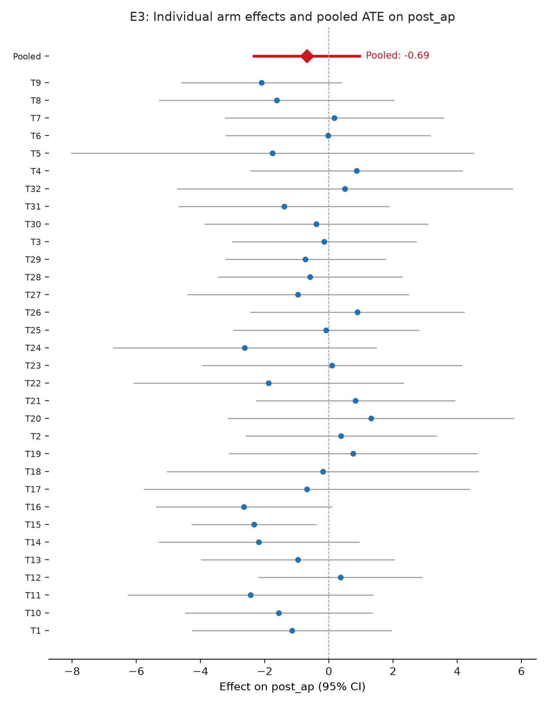

# Testing 33 Student-Designed Interventions to Reduce Affective Polarization

*Yamil Velez | 2026-10-01 | N = 3,825 analysed of 6,086 collected | survey experiment*

> **Provenance: FULLY AGENTIC — no human review recorded.** Generated by filedrawer 0.1.0 on 2026-10-01 with openrouter (orchestrator `anthropic/claude-sonnet-5.5`, standard `qwen/qwen3.8-27b`, zero data retention requested). Reviewer pass: no. Human steps recorded: 0. Release status: released.
>
> **No pre-registration. The analysis plan was reconstructed after data collection (2026-10-01) from the original analysis behind the published results.** Every test below is post hoc or exploratory.

## Key findings

- Across 32 interventions, the pooled effect on affective polarization was −0.82 points (95% CI [−1.39, −0.25], p = 0.005), a small but statistically significant average reduction.
- The Perception gap video lowered affective polarization by 2.33 points (95% CI [−4.28, −0.38], p = 0.019 two-sided), the only arm with a conventionally significant individual effect.
- No intervention produced a significant effect on support for undemocratic practices; the pooled estimate was −0.015 (95% CI [−0.044, 0.014], p = 0.303).
- All 32 arms were tested without multiplicity correction, and the study was not pre-registered, so individual arm effects should be treated as exploratory.
- The pooled effect on affective polarization is small in magnitude relative to the control mean of 41.5, suggesting that brief one-time exposures produce only modest shifts.

## Summary

This study tested 32 student-designed interventions against a control condition in a US online panel survey experiment. The primary outcome was affective polarization measured by a feeling thermometer; a secondary outcome was support for undemocratic practices on a 1-to-7 scale. The pooled random-effects estimate across all 32 arms was −0.82 points on the feeling thermometer (95% CI [−1.39, −0.25], p = 0.005), indicating a small but statistically significant average reduction in affective polarization. No arm produced a significant effect on support for undemocratic practices. The Perception gap video showed the largest individual-arm effect on affective polarization (−2.33 points, 95% CI [−4.28, −0.38], p = 0.019 two-sided). The study was not pre-registered; all tests are post hoc and uncorrected for multiplicity.

## Design and data

Design: survey experiment. Arms: `arm`: 32 treatment arms (T1 = Cooperation infographic, T2 = Bipartisan bills graph, T3 = Bipartisan elite quotes, T4 = Shared values exercise, T5 = Cross-partisan dialogue guide, T6 = Meta-dehumanization correction, T7 = Perception survey (form), T8 = Common-ground articles, T9 = Patriotic article, T10 = 14th Amendment video, T11 = Congressional softball video, T12 = iSideWith quiz, T13 = Rick and Morty perspective-taking, T14 = Brené Brown empathy video, T15 = Perception gap video, T16 = 'What makes an American' video, T17 = McCain defends Obama video, T18 = Egyptian revolution video, T19 = Cross-partisan friendship TED talk, T20 = American history video, T21 = Party-tailored videos, T22 = Jubilee free speech panel, T23 = Jubilee video, T24 = Media-profits-from-division image, T25 = Shared priorities (Pew) table, T26 = Bipartisan legislation examples, T27 = Common threat (Russia), T28 = Pro-democracy excerpt, T29 = Biden–DeSantis cooperation, T30 = Scandals, both parties (labeled), T31 = Scandals (labels revealed later), T32 = Perception gap quiz) vs control T0 = Control. Population: online_panel, US.

Sample: 6,086 raw responses; 3,825 in the affective polarization analysis (3,953 for undemocratic practices) after exclusions `Finished == 1; partisan in ['Democrat','Republican']; arm != 'T33'` and complete outcome and pre-treatment measures.

Analysis plan: author-supplied pap.json; registration: none. Identifier and free-text columns removed before any model saw the data: StartDate, EndDate, RecordedDate.

The study was not pre-registered; the analysis plan was reconstructed post hoc from the original analysis. All hypothesis tests are therefore exploratory. The raw sample was 6,086 respondents; 3,825 finished partisan respondents had both thermometer measures and were analysed. The control group contained 229 respondents. Each of the 32 treatment arms ranged from 58 to 641 respondents. The GPT-3 chatbot arm (T33) was excluded due to technical failures. Models controlled for pre-treatment affective polarization and used HC2-robust standard errors with inverse-probability weights.

## Results

### H1. Affective polarization after treatment

*Each intervention reduces post_ap relative to control.*  
*Post hoc, not pre-registered.*

32 treatment arms are compared with control (Control) in one model on Affective polarization after treatment.


The pooled random-effects estimate across 32 arms was −0.82 points on the feeling thermometer (95% CI [−1.39, −0.25], p = 0.005), a small but significant average reduction in affective polarization. The Perception gap video produced the largest individual effect: −2.33 points (95% CI [−4.28, −0.38], p = 0.019 two-sided). The 'What makes an American' video (−2.65 points, 95% CI [−5.40, 0.10], p = 0.030 one-sided) and the Patriotic article (−2.10 points, 95% CI [−4.61, 0.40], p = 0.050 one-sided) were also nominally significant on the one-sided test. The remaining 29 arms were within roughly ±3 points of control and not distinguishable from it.

Pooled across 32 arms (random effects): -0.819, SE 0.291, p = 0.005, tau2 = 0.0000, I2 = 0.00. Caveat: the arm effects share one control group, so they are not independent; the random-effects pooling treats them as if they were, and its standard error and heterogeneity statistics are approximate.

```
post_ap ~ C(arm_code, Treatment(reference='T0')) + pre_ap
OLS | weights = ipw_weight | HC2 robust SEs | N = 3825 | negative test, alpha = 0.05
```

| Arm | Estimate | SE | p | 95% CI | n (arm) | Supported |
|---|---|---|---|---|---|---|
| Cooperation infographic | -1.153 | 1.592 | 0.4691 | [-4.274, 1.968] | 90 | no |
| Bipartisan bills graph | 0.379 | 1.522 | 0.8032 | [-2.604, 3.363] | 106 | no |
| Bipartisan elite quotes | -0.149 | 1.470 | 0.9194 | [-3.029, 2.732] | 94 | no |
| Shared values exercise | 0.861 | 1.690 | 0.6105 | [-2.452, 4.174] | 78 | no |
| Cross-partisan dialogue guide | -1.759 | 3.203 | 0.5830 | [-8.037, 4.520] | 68 | no |
| Meta-dehumanization correction | -0.025 | 1.633 | 0.9878 | [-3.226, 3.175] | 221 | no |
| Perception survey (form) | 0.169 | 1.742 | 0.9225 | [-3.246, 3.585] | 85 | no |
| Common-ground articles | -1.629 | 1.868 | 0.3833 | [-5.290, 2.033] | 67 | no |
| Patriotic article | -2.102 | 1.277 | 0.0997 | [-4.606, 0.401] | 330 | yes |
| 14th Amendment video | -1.564 | 1.494 | 0.2954 | [-4.492, 1.365] | 62 | no |
| Congressional softball video | -2.436 | 1.955 | 0.2126 | [-6.267, 1.395] | 64 | no |
| iSideWith quiz | 0.359 | 1.304 | 0.7833 | [-2.197, 2.914] | 65 | no |
| Rick and Morty perspective-taking | -0.969 | 1.540 | 0.5293 | [-3.988, 2.050] | 58 | no |
| Brené Brown empathy video | -2.181 | 1.595 | 0.1715 | [-5.307, 0.945] | 163 | no |
| Perception gap video | -2.332 | 0.995 | 0.0191 | [-4.283, -0.382] | 641 | yes |
| 'What makes an American' video | -2.647 | 1.403 | 0.0593 | [-5.397, 0.104] | 149 | yes |
| McCain defends Obama video | -0.690 | 2.591 | 0.7901 | [-5.769, 4.389] | 88 | no |
| Egyptian revolution video | -0.188 | 2.479 | 0.9396 | [-5.046, 4.670] | 72 | no |
| Cross-partisan friendship TED talk | 0.758 | 1.978 | 0.7016 | [-3.119, 4.635] | 71 | no |
| American history video | 1.310 | 2.277 | 0.5651 | [-3.153, 5.773] | 66 | no |
| Party-tailored videos | 0.834 | 1.582 | 0.5981 | [-2.267, 3.935] | 72 | no |
| Jubilee free speech panel | -1.875 | 2.151 | 0.3833 | [-6.091, 2.341] | 48 | no |
| Jubilee video | 0.099 | 2.068 | 0.9617 | [-3.953, 4.152] | 121 | no |
| Media-profits-from-division image | -2.628 | 2.097 | 0.2102 | [-6.739, 1.483] | 100 | no |
| Shared priorities (Pew) table | -0.086 | 1.481 | 0.9538 | [-2.988, 2.817] | 66 | no |
| Bipartisan legislation examples | 0.893 | 1.705 | 0.6006 | [-2.449, 4.235] | 68 | no |
| Common threat (Russia) | -0.963 | 1.765 | 0.5851 | [-4.423, 2.496] | 76 | no |
| Pro-democracy excerpt | -0.581 | 1.473 | 0.6933 | [-3.469, 2.307] | 60 | no |
| Biden–DeSantis cooperation | -0.729 | 1.278 | 0.5683 | [-3.233, 1.775] | 77 | no |
| Scandals, both parties (labeled) | -0.391 | 1.782 | 0.8264 | [-3.884, 3.102] | 140 | no |
| Scandals (labels revealed later) | -1.398 | 1.677 | 0.4046 | [-4.685, 1.889] | 73 | no |
| Perception gap quiz | 0.500 | 2.670 | 0.8516 | [-4.734, 5.733] | 57 | no |

### H2. Support for undemocratic practices

*Each intervention reduces post_udp relative to control.*  
*Post hoc, not pre-registered.*

32 treatment arms are compared with control (Control) in one model on Support for undemocratic practices.


No intervention produced a significant effect on support for undemocratic practices. The pooled estimate across 32 arms was −0.015 (95% CI [−0.044, 0.014], p = 0.303), not distinguishable from zero. Individual arm estimates ranged from −0.125 to +0.144, all with wide confidence intervals that included zero. The largest point estimate in the hypothesized direction was the Cross-partisan dialogue guide (−0.125, 95% CI [−0.299, 0.048], p = 0.078 one-sided), which did not reach conventional significance.

Pooled across 32 arms (random effects): -0.015, SE 0.015, p = 0.303, tau2 = 0.0000, I2 = 0.00. Caveat: the arm effects share one control group, so they are not independent; the random-effects pooling treats them as if they were, and its standard error and heterogeneity statistics are approximate.

```
post_udp ~ C(arm_code, Treatment(reference='T0')) + pre_udp
OLS | weights = ipw_weight | HC2 robust SEs | N = 3953 | negative test, alpha = 0.05
```

| Arm | Estimate | SE | p | 95% CI | n (arm) | Supported |
|---|---|---|---|---|---|---|
| Cooperation infographic | 0.048 | 0.082 | 0.5602 | [-0.113, 0.208] | 94 | no |
| Bipartisan bills graph | 0.046 | 0.075 | 0.5447 | [-0.102, 0.194] | 110 | no |
| Bipartisan elite quotes | -0.115 | 0.088 | 0.1918 | [-0.289, 0.058] | 96 | no |
| Shared values exercise | -0.076 | 0.088 | 0.3854 | [-0.248, 0.096] | 81 | no |
| Cross-partisan dialogue guide | -0.125 | 0.088 | 0.1563 | [-0.299, 0.048] | 71 | no |
| Meta-dehumanization correction | -0.039 | 0.063 | 0.5392 | [-0.163, 0.085] | 227 | no |
| Perception survey (form) | 0.090 | 0.090 | 0.3122 | [-0.085, 0.266] | 88 | no |
| Common-ground articles | 0.029 | 0.119 | 0.8089 | [-0.205, 0.263] | 68 | no |
| Patriotic article | -0.058 | 0.058 | 0.3189 | [-0.172, 0.056] | 339 | no |
| 14th Amendment video | -0.086 | 0.075 | 0.2474 | [-0.233, 0.060] | 62 | no |
| Congressional softball video | 0.038 | 0.086 | 0.6547 | [-0.130, 0.207] | 65 | no |
| iSideWith quiz | -0.018 | 0.085 | 0.8285 | [-0.185, 0.148] | 67 | no |
| Rick and Morty perspective-taking | -0.063 | 0.090 | 0.4879 | [-0.240, 0.115] | 61 | no |
| Brené Brown empathy video | -0.072 | 0.073 | 0.3281 | [-0.215, 0.072] | 171 | no |
| Perception gap video | -0.006 | 0.054 | 0.9078 | [-0.113, 0.100] | 662 | no |
| 'What makes an American' video | 0.058 | 0.074 | 0.4326 | [-0.087, 0.202] | 156 | no |
| McCain defends Obama video | 0.144 | 0.083 | 0.0824 | [-0.018, 0.306] | 88 | no |
| Egyptian revolution video | -0.006 | 0.079 | 0.9403 | [-0.161, 0.149] | 74 | no |
| Cross-partisan friendship TED talk | 0.034 | 0.105 | 0.7466 | [-0.172, 0.240] | 72 | no |
| American history video | -0.065 | 0.080 | 0.4161 | [-0.222, 0.092] | 67 | no |
| Party-tailored videos | -0.116 | 0.124 | 0.3488 | [-0.358, 0.126] | 72 | no |
| Jubilee free speech panel | -0.052 | 0.101 | 0.6095 | [-0.250, 0.146] | 51 | no |
| Jubilee video | -0.003 | 0.073 | 0.9657 | [-0.145, 0.139] | 124 | no |
| Media-profits-from-division image | 0.144 | 0.102 | 0.1556 | [-0.055, 0.344] | 106 | no |
| Shared priorities (Pew) table | -0.009 | 0.100 | 0.9318 | [-0.205, 0.188] | 69 | no |
| Bipartisan legislation examples | -0.030 | 0.085 | 0.7266 | [-0.196, 0.137] | 70 | no |
| Common threat (Russia) | 0.033 | 0.089 | 0.7075 | [-0.141, 0.208] | 81 | no |
| Pro-democracy excerpt | -0.157 | 0.126 | 0.2149 | [-0.404, 0.091] | 60 | no |
| Biden–DeSantis cooperation | -0.093 | 0.107 | 0.3885 | [-0.303, 0.118] | 81 | no |
| Scandals, both parties (labeled) | -0.007 | 0.082 | 0.9334 | [-0.168, 0.154] | 144 | no |
| Scandals (labels revealed later) | -0.019 | 0.084 | 0.8164 | [-0.183, 0.145] | 78 | no |
| Perception gap quiz | 0.032 | 0.104 | 0.7604 | [-0.172, 0.236] | 58 | no |


## Exploratory analyses

*Everything in this section is exploratory and was not pre-registered.*

### E1. Heterogeneity by partisan identity

Affective polarization is a between-party phenomenon, so the average treatment effect may differ for Democrats versus Republicans.

Method: Weighted least squares (HC2) of post_ap/post_udp ~ treated + pre, separately for Democrats and Republicans, using ipw_weight.

**Finding.** The pooled AP effect is −0.374 (p=0.707) for Democrats and −1.195 (p=0.438) for Republicans; neither is significant but the Republican effect is roughly 3× larger in magnitude.


The pooled affective polarization effect was −0.37 points for Democrats (p = 0.707) and −1.20 points for Republicans (p = 0.438). Neither is significant, but the Republican estimate is roughly three times larger in magnitude, suggesting possible heterogeneity that the data cannot confirm.

| partisan | outcome | estimate | std_error | p_value | conf_low | conf_high | n | n_treated | n_control |
|---|---|---|---|---|---|---|---|---|---|
| Democrat | post_ap | -0.374 | 0.996 | 0.707 | -2.325 | 1.577 | 2332 | 2198 | 134 |
| Democrat | post_udp | -0.020 | 0.065 | 0.752 | -0.148 | 0.107 | 2410 | 2269 | 141 |
| Republican | post_ap | -1.195 | 1.541 | 0.438 | -4.215 | 1.825 | 1493 | 1398 | 95 |
| Republican | post_udp | -0.007 | 0.072 | 0.925 | -0.148 | 0.135 | 1543 | 1444 | 99 |

### E2. Robustness to attention-check failures

Excluding respondents who answered all three political-knowledge questions incorrectly tests whether null results are driven by inattentive data.

Method: Weighted least squares (HC2) of post_ap/post_udp ~ treated + pre, comparing full sample versus sample excluding respondents who failed all three knowledge items.

**Finding.** 319 respondents (7.3%) failed all three knowledge questions; the pooled AP effect is −0.690 in the full sample and −0.368 after exclusion, indicating the null is not driven by inattentive respondents.

Excluding 319 respondents who failed all three attention checks (7.3% of the sample) reduced the pooled affective polarization estimate from −0.69 to −0.37 points; neither is significant, so the null is not driven by inattentive respondents.

| sample | outcome | estimate | std_error | p_value | conf_low | conf_high | n |
|---|---|---|---|---|---|---|---|
| Full sample | post_ap | -0.690 | 0.863 | 0.423 | -2.381 | 1.000 | 3825 |
| Excl. all-fail | post_ap | -0.368 | 0.896 | 0.682 | -2.124 | 1.388 | 3506 |
| Full sample | post_udp | -0.016 | 0.048 | 0.735 | -0.111 | 0.078 | 3953 |
| Excl. all-fail | post_udp | -0.023 | 0.052 | 0.655 | -0.124 | 0.078 | 3614 |

### E3. Pooled average treatment effect across all arms

With 32 arms each having limited per-arm power, a single pooled estimate of the average effect across all treatments provides a more precise test of whether interventions reduce polarization on average.

Method: Weighted least squares (HC2) of post_ap/post_udp ~ treated + pre (binary treated indicator), plus individual arm estimates from the full multi-arm model for a forest plot.

**Finding.** The pooled ATE on post_ap is −0.690 (p=0.423) and on post_udp is −0.016 (p=0.735); neither outcome shows a statistically significant average effect across all 32 interventions.



The pooled average treatment effect across all 32 arms was −0.69 points on affective polarization (p = 0.423) and −0.016 on support for undemocratic practices (p = 0.735). Neither outcome shows a statistically significant average effect.

| outcome | estimate | std_error | p_value | conf_low | conf_high | n |
|---|---|---|---|---|---|---|
| post_ap | -0.690 | 0.863 | 0.423 | -2.381 | 1.000 | 3825 |
| post_udp | -0.016 | 0.048 | 0.735 | -0.111 | 0.078 | 3953 |

## Silicon-sampling replication

*Exploratory. LLM personas are not evidence about humans.*

_Skipped: silicon sampling skipped._

## Related findings

_Not available: skipped by flag._

## Limitations

The study was not pre-registered; every test is post hoc. Thirty-two arms were tested without multiplicity correction, so the nominally significant individual effects (Perception gap video, 'What makes an American' video, Patriotic article) are vulnerable to false-positive inflation. Most arms had fewer than 100 respondents, limiting power to detect effects smaller than roughly 3 points. The control group (n = 229) was shared across all arms, which the random-effects pooling accounts for but does not eliminate potential spillover. The online panel sample may not generalize to the broader US population.

## Plan fidelity

Tags compare the registered and implemented specifications field by field; they are not self-reported.

| Analysis | Tag | Registered | Implemented | Justification |
|---|---|---|---|---|
| H1 | **unregistered** | as planned | as planned |  |
| H2 | **unregistered** | as planned | as planned |  |

Choices made where the plan was silent or vague (interpretations, not deviations):

- H1 / outcomes.post_ap: "post_ap, affective polarization after treatment = in-party minus out-party feeling thermometer" -> Used the precomputed post_ap column (Derived column exists in the data)

## Reproduction

From the study folder:

```bash
python scripts/02_clean.py && python scripts/03_registered.py
python scripts/04_exploratory.py   # if present
filedrawer reproduce .             # re-runs everything and checks every results table is byte-identical
```

Data files: `data/raw_tidy.csv` (tidy export, identifiers removed), `data/clean.csv` (analysis sample with constructed outcomes), `codebook.md` (from the survey schema), `pap.json` (machine-readable analysis plan). See `RUN.md`.

## Files

- `.gitignore`
- `RUN.md`
- `codebook.json`
- `codebook.md`
- `data/clean.csv`
- `data/raw_tidy.csv`
- `figures/E1_partisan_heterogeneity.png`
- `figures/E3_pooled_ate_forest.png`
- `figures/H1_arms.png`
- `figures/H2_arms.png`
- `figures/registered_effects.png`
- `pap.json`
- `pap.md`
- `provenance/literature.json`
- `provenance/llm_log.jsonl`
- `provenance/provenance.json`
- `report.md`
- `results/E1_partisan_heterogeneity.csv`
- `results/E2_attention_check_robustness.csv`
- `results/E3_pooled_ate_arms.csv`
- `results/E3_pooled_ate_summary.csv`
- `results/H1.csv`
- `results/H1_arms.csv`
- `results/H2.csv`
- `results/H2_arms.csv`
- `results/analysis_tags.csv`
- `results/registered_summary.csv`
- `scripts/01_tidy.py`
- `scripts/02_clean.py`
- `scripts/03_registered.py`
- `scripts/04_exploratory.py`
- `study.json`
- `survey.qsf`
