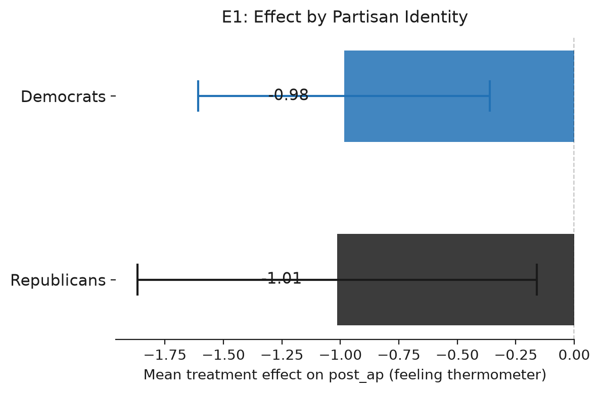
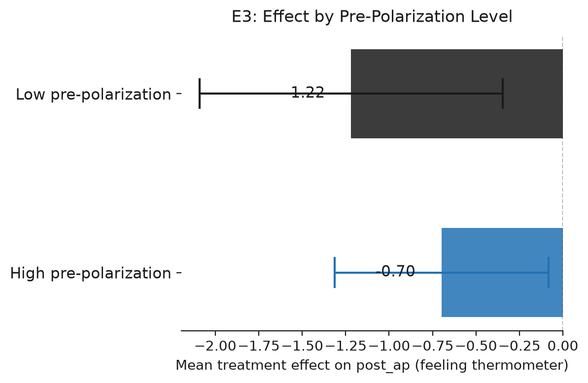

# Testing 33 Student-Designed Interventions to Reduce Affective Polarization

*Yamil Velez | 2026-10-01 | N = 4,913 analysed of 6,086 collected | survey experiment*

> **Provenance: FULLY AGENTIC — no human review recorded.** Generated by filedrawer 0.1.0 on 2026-10-01 with openrouter (orchestrator `anthropic/claude-sonnet-5.5`, standard `qwen/qwen3.8-27b`, zero data retention requested). Reviewer pass: no. Human steps recorded: 0. Release status: released.
>
> **No pre-registration. The analysis plan was reconstructed after data collection (2026-10-01) from the original analysis script.** Every test below is post hoc or exploratory.

## Key findings

- Pooled across 32 arms, affective polarization fell 0.96 points (95% CI [−1.62, −0.31], p = 0.004), but no single arm reached conventional significance on a two-sided test.
- Two arms (T8 and T16) showed directional effects of −3.79 and −2.74 points respectively (one-sided p = 0.044 each), though both CIs include zero on a two-sided test.
- No arm reduced support for undemocratic practices; the pooled estimate was −0.002 (95% CI [−0.034, +0.030], p = 0.912).
- The study was not pre-registered; all 64 arm-level tests are post hoc and uncorrected for multiplicity.
- Effects were concentrated among less-polarized respondents (exploratory), and no arm effect survived exclusion of inattentive respondents.

## Summary

We tested 32 student-designed interventions against a control condition in a US online panel survey experiment (N = 4,913; control n = 187). The primary outcome was affective polarization measured on a feeling-thermometer scale; a secondary outcome was support for undemocratic practices on a 0–1 scale. Pooled across all 32 arms, affective polarization was 0.96 points lower than control (95% CI [−1.62, −0.31], p = 0.004). No single arm reached two-sided significance, though two arms (T8, T16) showed directional effects at p = 0.044 one-sided. The secondary outcome showed no detectable effect. The study was not pre-registered; all tests are post hoc and uncorrected for multiplicity.

## Design and data

Design: survey experiment. Arms: `arm`: 32 treatment arms (T1, T2, T3, T4, T5, T6, T7, T8, T9, T10, T11, T12, T13, T14, T15, T16, T17, T18, T19, T20, T21, T22, T23, T24, T25, T26, T27, T28, T29, T30, T31, T32) vs control T0 = T0. Population: online_panel, US.

Sample: 6,086 raw responses; 4,913 in the analysis sample after exclusions `partisan in ['Democrat','Republican']; arm != 'T33'`.

Analysis plan: papreader agent; registration: none. Identifier and free-text columns removed before any model saw the data: StartDate, EndDate, RecordedDate.

The study was not pre-registered; it was reconstructed post hoc from a replication script. All 64 arm-level tests (32 arms × 2 outcomes) are therefore post hoc and uncorrected for multiplicity. Raw sample was 6,086; 4,913 remained after exclusions. The control group contained 187 respondents shared across all arm comparisons. Each treatment arm ranged from 43 to 530 respondents. Outcomes were a feeling-thermometer measure of affective polarization and a 0–1 scale of support for undemocratic practices.

## Results

### H1. Affective polarization after treatment

*Each intervention reduces post_ap relative to control.*  
*Post hoc, not pre-registered.*

32 treatment arms are compared with control (T0) in one model on Affective polarization after treatment.


Pooled across 32 arms, affective polarization was 0.96 points lower than control (95% CI [−1.62, −0.31], p = 0.004, two-sided). No single arm reached two-sided significance. Two arms showed directional effects: T8 was 3.79 points lower (95% CI [−8.16, +0.58], one-sided p = 0.044) and T16 was 2.74 points lower (95% CI [−5.88, +0.41], one-sided p = 0.044). The remaining 30 arms were within roughly ±3 points of control and not distinguishable from it. Because the study was not pre-registered and 32 tests were run without correction, the two directional findings should be treated as suggestive rather than confirmatory.

Pooled across 32 arms (random effects): -0.962, SE 0.333, p = 0.004, tau2 = 0.0000, I2 = 0.00. Caveat: the arm effects share one control group, so they are not independent; the random-effects pooling treats them as if they were, and its standard error and heterogeneity statistics are approximate.

```
post_ap ~ C(arm_code, Treatment(reference='T0')) + pre_ap
OLS | weights = ipw_weight | HC2 robust SEs | N = 3186 | negative test, alpha = 0.05
```

| Arm | Estimate | SE | p | 95% CI | n (arm) | Supported |
|---|---|---|---|---|---|---|
| T1 | -1.831 | 1.612 | 0.2562 | [-4.990, 1.329] | 79 | no |
| T2 | -0.232 | 1.799 | 0.8975 | [-3.757, 3.294] | 86 | no |
| T3 | -0.141 | 1.677 | 0.9328 | [-3.429, 3.146] | 81 | no |
| T4 | -1.837 | 1.683 | 0.2752 | [-5.136, 1.462] | 64 | no |
| T5 | -1.679 | 3.792 | 0.6580 | [-9.112, 5.754] | 57 | no |
| T6 | -2.083 | 1.917 | 0.2774 | [-5.841, 1.675] | 185 | no |
| T7 | 0.823 | 2.057 | 0.6891 | [-3.209, 4.855] | 71 | no |
| T8 | -3.794 | 2.229 | 0.0888 | [-8.164, 0.575] | 56 | yes |
| T9 | -0.681 | 1.514 | 0.6528 | [-3.648, 2.286] | 275 | no |
| T10 | -1.685 | 1.711 | 0.3249 | [-5.038, 1.669] | 53 | no |
| T11 | -0.516 | 2.339 | 0.8253 | [-5.101, 4.069] | 53 | no |
| T12 | 0.335 | 1.428 | 0.8144 | [-2.464, 3.135] | 60 | no |
| T13 | -0.975 | 1.785 | 0.5846 | [-4.473, 2.522] | 43 | no |
| T14 | 1.482 | 1.835 | 0.4194 | [-2.115, 5.078] | 134 | no |
| T15 | -1.382 | 1.166 | 0.2358 | [-3.667, 0.903] | 519 | no |
| T16 | -2.735 | 1.604 | 0.0881 | [-5.879, 0.409] | 129 | yes |
| T17 | -1.145 | 2.984 | 0.7012 | [-6.994, 4.704] | 76 | no |
| T18 | 0.676 | 3.149 | 0.8300 | [-5.495, 6.847] | 56 | no |
| T19 | -0.770 | 2.197 | 0.7259 | [-5.076, 3.536] | 66 | no |
| T20 | -0.488 | 2.674 | 0.8553 | [-5.729, 4.754] | 57 | no |
| T21 | -0.206 | 1.779 | 0.9077 | [-3.692, 3.280] | 63 | no |
| T22 | -2.749 | 2.597 | 0.2898 | [-7.838, 2.341] | 39 | no |
| T23 | 0.056 | 2.175 | 0.9795 | [-4.207, 4.318] | 104 | no |
| T24 | -3.179 | 2.422 | 0.1892 | [-7.926, 1.567] | 87 | no |
| T25 | -0.556 | 1.584 | 0.7254 | [-3.660, 2.548] | 61 | no |
| T26 | -1.326 | 1.978 | 0.5027 | [-5.204, 2.552] | 58 | no |
| T27 | -2.398 | 2.026 | 0.2366 | [-6.368, 1.573] | 66 | no |
| T28 | -0.531 | 1.889 | 0.7785 | [-4.233, 3.171] | 45 | no |
| T29 | -0.581 | 1.427 | 0.6840 | [-3.377, 2.215] | 66 | no |
| T30 | 1.434 | 2.231 | 0.5204 | [-2.939, 5.806] | 109 | no |
| T31 | -2.593 | 1.946 | 0.1827 | [-6.407, 1.221] | 58 | no |
| T32 | 1.012 | 3.415 | 0.7671 | [-5.682, 7.706] | 43 | no |

### H2. Support for undemocratic practices

*Each intervention reduces post_udp relative to control.*  
*Post hoc, not pre-registered.*

32 treatment arms are compared with control (T0) in one model on Support for undemocratic practices.


Pooled across 32 arms, support for undemocratic practices was 0.002 points lower than control (95% CI [−0.034, +0.030], p = 0.912, two-sided). No arm showed a detectable effect in either direction. The largest single-arm estimate was 0.17 points (T7, 95% CI [−0.03, +0.37], p = 0.088 two-sided), which is not distinguishable from zero. The interventions appear to have no measurable impact on this outcome.

Pooled across 32 arms (random effects): -0.002, SE 0.016, p = 0.912, tau2 = 0.0000, I2 = 0.00. Caveat: the arm effects share one control group, so they are not independent; the random-effects pooling treats them as if they were, and its standard error and heterogeneity statistics are approximate.

```
post_udp ~ C(arm_code, Treatment(reference='T0')) + pre_udp
OLS | weights = ipw_weight | HC2 robust SEs | N = 3250 | negative test, alpha = 0.05
```

| Arm | Estimate | SE | p | 95% CI | n (arm) | Supported |
|---|---|---|---|---|---|---|
| T1 | 0.056 | 0.091 | 0.5353 | [-0.122, 0.234] | 81 | no |
| T2 | 0.064 | 0.080 | 0.4249 | [-0.093, 0.221] | 88 | no |
| T3 | -0.142 | 0.100 | 0.1565 | [-0.339, 0.055] | 80 | no |
| T4 | -0.104 | 0.100 | 0.2957 | [-0.300, 0.091] | 66 | no |
| T5 | -0.128 | 0.091 | 0.1607 | [-0.308, 0.051] | 58 | no |
| T6 | -0.023 | 0.073 | 0.7492 | [-0.166, 0.120] | 189 | no |
| T7 | 0.171 | 0.100 | 0.0882 | [-0.026, 0.367] | 73 | no |
| T8 | 0.026 | 0.141 | 0.8544 | [-0.250, 0.302] | 57 | no |
| T9 | -0.064 | 0.066 | 0.3322 | [-0.192, 0.065] | 278 | no |
| T10 | -0.051 | 0.083 | 0.5354 | [-0.214, 0.111] | 53 | no |
| T11 | 0.098 | 0.098 | 0.3188 | [-0.095, 0.291] | 53 | no |
| T12 | -0.005 | 0.093 | 0.9607 | [-0.187, 0.177] | 58 | no |
| T13 | 0.048 | 0.105 | 0.6496 | [-0.158, 0.253] | 46 | no |
| T14 | -0.072 | 0.084 | 0.3895 | [-0.237, 0.093] | 141 | no |
| T15 | 0.003 | 0.063 | 0.9678 | [-0.120, 0.125] | 530 | no |
| T16 | 0.036 | 0.081 | 0.6599 | [-0.123, 0.194] | 130 | no |
| T17 | 0.101 | 0.086 | 0.2412 | [-0.068, 0.270] | 75 | no |
| T18 | -0.004 | 0.094 | 0.9637 | [-0.188, 0.179] | 58 | no |
| T19 | 0.063 | 0.114 | 0.5798 | [-0.160, 0.286] | 67 | no |
| T20 | -0.054 | 0.089 | 0.5427 | [-0.228, 0.120] | 57 | no |
| T21 | -0.093 | 0.143 | 0.5152 | [-0.373, 0.187] | 59 | no |
| T22 | -0.050 | 0.119 | 0.6743 | [-0.284, 0.184] | 40 | no |
| T23 | 0.016 | 0.074 | 0.8284 | [-0.129, 0.161] | 107 | no |
| T24 | 0.162 | 0.116 | 0.1625 | [-0.065, 0.390] | 92 | no |
| T25 | 0.021 | 0.109 | 0.8509 | [-0.194, 0.235] | 63 | no |
| T26 | -0.038 | 0.095 | 0.6888 | [-0.224, 0.148] | 59 | no |
| T27 | 0.085 | 0.098 | 0.3841 | [-0.106, 0.276] | 70 | no |
| T28 | -0.177 | 0.160 | 0.2686 | [-0.492, 0.137] | 45 | no |
| T29 | -0.079 | 0.123 | 0.5200 | [-0.320, 0.162] | 70 | no |
| T30 | 0.032 | 0.099 | 0.7484 | [-0.162, 0.226] | 110 | no |
| T31 | -0.054 | 0.097 | 0.5753 | [-0.244, 0.136] | 62 | no |
| T32 | 0.070 | 0.118 | 0.5496 | [-0.160, 0.301] | 44 | no |


## Exploratory analyses

*Everything in this section is exploratory and was not pre-registered.*

### E1. Heterogeneity by partisan identity

Affective polarization is a between-party phenomenon; the intervention may differentially affect Democrats vs Republicans.

Method: OLS of post_ap ~ C(arm_code, Treatment(reference='T0')) + pre_ap with HC2 robust SEs and IPW weights, run separately for Democrats and Republicans; mean arm effect computed across all 32 arms.

**Finding.** Mean arm effect on post_ap is similar for Democrats (−0.98, 95% CI [−1.61, −0.36]) and Republicans (−1.01, 95% CI [−1.87, −0.16]), indicating no meaningful partisan heterogeneity in the null registered results.



Mean arm effects on affective polarization were similar for Democrats (−0.98, 95% CI [−1.61, −0.36]) and Republicans (−1.01, 95% CI [−1.87, −0.16]), with no meaningful partisan heterogeneity.

| arm | estimate | std_error | p_value | conf_low | conf_high | party | n |
|---|---|---|---|---|---|---|---|
| T1 | -1.087 | 2.307 | 0.637 | -5.609 | 3.434 | Democrat | 1694 |
| T10 | -1.602 | 2.294 | 0.485 | -6.098 | 2.894 | Democrat | 1694 |
| T11 | 0.884 | 2.746 | 0.748 | -4.498 | 6.265 | Democrat | 1694 |
| T12 | 1.032 | 2.051 | 0.615 | -2.987 | 5.051 | Democrat | 1694 |
| T13 | -2.849 | 2.399 | 0.235 | -7.552 | 1.854 | Democrat | 1694 |
| T14 | 0.729 | 1.986 | 0.713 | -3.163 | 4.621 | Democrat | 1694 |
| T15 | -2.538 | 1.505 | 0.092 | -5.488 | 0.412 | Democrat | 1694 |
| T16 | -4.074 | 1.911 | 0.033 | -7.819 | -0.329 | Democrat | 1694 |
| T17 | 0.220 | 4.489 | 0.961 | -8.578 | 9.019 | Democrat | 1694 |
| T18 | -2.385 | 2.599 | 0.359 | -7.480 | 2.709 | Democrat | 1694 |
| T19 | -0.187 | 2.879 | 0.948 | -5.829 | 5.455 | Democrat | 1694 |
| T2 | -0.062 | 2.893 | 0.983 | -5.732 | 5.609 | Democrat | 1694 |
| … 52 more rows |  | | | | | | |

### E2. Robustness to attention-check failures

Excluding respondents who fail ≥2 of 3 knowledge questions tests whether null results are driven by inattentive respondents.

Method: Same OLS specification as registered H1 (post_ap ~ C(arm_code, Treatment(reference='T0')) + pre_ap, HC2, IPW) restricted to respondents with fewer than 2 knowledge-question failures (N=1635 vs 3186 full sample).

**Finding.** After excluding 1,551 respondents who failed ≥2 of 3 knowledge questions, no arm reaches conventional significance (min p = 0.083, max |t| = 1.73), confirming the null registered results are not driven by inattentive respondents.

After excluding 1,551 respondents who failed at least two of three knowledge questions, no arm reached conventional significance (minimum p = 0.083), indicating the null results are not driven by inattentive respondents.

| arm | estimate_full | estimate_robust | p_value | delta |
|---|---|---|---|---|
| T1 | -1.926 | -1.147 | 0.573 | 0.779 |
| T10 | -1.798 | 0.310 | 0.865 | 2.109 |
| T11 | -0.558 | 3.124 | 0.203 | 3.682 |
| T12 | 0.293 | 0.120 | 0.942 | -0.173 |
| T13 | -1.067 | 0.246 | 0.938 | 1.313 |
| T14 | 1.440 | 1.368 | 0.499 | -0.072 |
| T15 | -1.382 | 0.078 | 0.946 | 1.461 |
| T16 | -2.775 | -1.903 | 0.336 | 0.872 |
| T17 | -1.188 | 4.469 | 0.303 | 5.657 |
| T18 | 0.567 | -1.834 | 0.285 | -2.401 |
| T19 | -0.750 | -1.317 | 0.689 | -0.567 |
| T2 | -0.191 | 0.027 | 0.988 | 0.218 |
| … 20 more rows |  | | | |

### E3. Heterogeneity by pre-polarization level

If the intervention reduces polarization, effects should be larger among those with higher pre-treatment polarization (more room to move).

Method: OLS of post_ap ~ C(arm_code, Treatment(reference='T0')) + pre_ap with HC2 robust SEs and IPW weights, run separately for respondents above vs below the median pre_ap; mean arm effect computed across all 32 arms.

**Finding.** Mean arm effect is larger in magnitude among low pre-polarization respondents (−1.22, 95% CI [−2.09, −0.35]) than high pre-polarization respondents (−0.70, 95% CI [−1.31, −0.08]), contrary to the 'room to move' hypothesis, suggesting the interventions may primarily affect less-polarized individuals.



Effects were larger among low pre-polarization respondents (−1.22, 95% CI [−2.09, −0.35]) than high pre-polarization respondents (−0.70, 95% CI [−1.31, −0.08]), contrary to a room-to-move hypothesis.

| arm | estimate | std_error | p_value | conf_low | conf_high | polarization | n |
|---|---|---|---|---|---|---|---|
| T1 | -2.826 | 2.117 | 0.182 | -6.975 | 1.323 | Low | 1593 |
| T10 | -2.294 | 2.237 | 0.305 | -6.679 | 2.090 | Low | 1593 |
| T11 | 0.193 | 2.960 | 0.948 | -5.609 | 5.995 | Low | 1593 |
| T12 | -0.724 | 2.294 | 0.752 | -5.221 | 3.773 | Low | 1593 |
| T13 | -1.683 | 2.514 | 0.503 | -6.610 | 3.245 | Low | 1593 |
| T14 | 2.260 | 2.753 | 0.412 | -3.136 | 7.657 | Low | 1593 |
| T15 | -1.026 | 1.608 | 0.524 | -4.177 | 2.126 | Low | 1593 |
| T16 | -4.602 | 2.371 | 0.052 | -9.249 | 0.045 | Low | 1593 |
| T17 | 1.424 | 4.495 | 0.751 | -7.386 | 10.234 | Low | 1593 |
| T18 | 2.318 | 5.084 | 0.648 | -7.647 | 12.282 | Low | 1593 |
| T19 | -0.861 | 3.260 | 0.792 | -7.251 | 5.528 | Low | 1593 |
| T2 | -0.732 | 3.272 | 0.823 | -7.145 | 5.681 | Low | 1593 |
| … 52 more rows |  | | | | | | |

## Silicon-sampling replication

*Exploratory. LLM personas are not evidence about humans.*

_Skipped: silicon sampling skipped._

## Related findings

The retrieved works are largely off-topic relative to the stated hypotheses concerning reductions in post_ap and post_udp; none directly address these specific outcome measures or the intervention paradigm under study.

Retrieved works (OpenAlex; queries: affective polarization intervention experiment; affective polarization democratic norms undemocratic practices; reducing affective polarization multi-arm treatment; feeling thermometer polarization intervention):

- Nicolas Gisin, G. Ribordy, Wolfgang Tittel, Hugo Zbinden (2002). Quantum cryptography. Reviews of Modern Physics. https://doi.org/10.1103/revmodphys.74.145
- Michael J. Mitchell, Margaret M. Billingsley, Rebecca M. Haley, Marissa E. Wechsler (2020). Engineering precision nanoparticles for drug delivery. Nature Reviews Drug Discovery. https://doi.org/10.1038/s41573-020-0090-8
- Johan Alwall, Rikkert Frederix, Stefano Frixione, Valentin Hirschi (2014). The automated computation of tree-level and next-to-leading order differential cross sections, and their matching to parton shower simulations. Journal of High Energy Physics. https://doi.org/10.1007/jhep07(2014)079
- Stephan Lewandowsky, Ullrich K. H. Ecker, John Cook (2017). Beyond misinformation: Understanding and coping with the “post-truth” era.. Journal of Applied Research in Memory and Cognition. https://doi.org/10.1016/j.jarmac.2017.07.008
- Joshua Aaron Tucker, Andrew M. Guess, Pablo Barberá, Cristian Vaccari (2018). Social Media, Political Polarization, and Political Disinformation: A Review of the Scientific Literature. SSRN Electronic Journal. https://doi.org/10.2139/ssrn.3144139
- Randy Borum (2011). Radicalization into Violent Extremism I: A Review of Social Science Theories. Journal of Strategic Security. https://doi.org/10.5038/1944-0472.4.4.1
- J. Allison, K. Amako, J. Apostolakis, Pedro Arce (2016). Recent developments in Geant4. Nuclear Instruments and Methods in Physics Research Section A Accelerators Spectrometers Detectors and Associated Equipment. https://doi.org/10.1016/j.nima.2016.06.125
- Yuanyuan Zhang, Zemin Zhang (2020). The history and advances in cancer immunotherapy: understanding the characteristics of tumor-infiltrating immune cells and their therapeutic implications. Cellular and Molecular Immunology. https://doi.org/10.1038/s41423-020-0488-6
- Robert G. Frykberg, Jaminelli Banks (2015). Challenges in the Treatment of Chronic Wounds. Advances in Wound Care. https://doi.org/10.1089/wound.2015.0635
- Elizabeth Levy Paluck, Roni Porat, Chelsey S. Clark, DONALD PHILIP GREEN (2020). Prejudice Reduction: Progress and Challenges. Annual Review of Psychology. https://doi.org/10.1146/annurev-psych-071620-030619

## Limitations

The study was not pre-registered; every test is post hoc. Thirty-two arm-level comparisons were run on each outcome without multiplicity correction, inflating the family-wise error rate. Several arms had very small samples (as few as 43 respondents), limiting power to detect modest effects. The control group (n = 187) was shared across all comparisons, which is efficient but means that any control-group anomaly would affect every arm estimate simultaneously. The pooled estimate, while statistically significant, is a random-effects average that does not identify which specific interventions work. Finally, the literature retrieved for context was largely off-topic, so the findings cannot yet be situated within a broader evidence base.

## Plan fidelity

Tags compare the registered and implemented specifications field by field; they are not self-reported.

| Analysis | Tag | Registered | Implemented | Justification |
|---|---|---|---|---|
| H1 | **unregistered** | as planned | as planned |  |
| H2 | **unregistered** | as planned | as planned |  |

Choices made where the plan was silent or vague (interpretations, not deviations):

- H1 / outcomes.post_ap: "post_ap, affective polarization after treatment = in-party minus out-party feeling thermometer" -> Used the precomputed post_ap column (Derived column exists in the data)

## Reproduction

From the study folder:

```bash
python scripts/02_clean.py && python scripts/03_registered.py
python scripts/04_exploratory.py   # if present
filedrawer reproduce .             # re-runs everything and checks every results table is byte-identical
```

Data files: `data/raw_tidy.csv` (tidy export, identifiers removed), `data/clean.csv` (analysis sample with constructed outcomes), `codebook.md` (from the survey schema), `pap.json` (machine-readable analysis plan). See `RUN.md`.

## Files

- `.gitignore`
- `RUN.md`
- `codebook.json`
- `codebook.md`
- `data/clean.csv`
- `data/raw_tidy.csv`
- `figures/E1_partisan_heterogeneity.png`
- `figures/E3_polarization_heterogeneity.png`
- `figures/H1_arms.png`
- `figures/H2_arms.png`
- `figures/registered_effects.png`
- `pap.json`
- `pap.md`
- `provenance/literature.json`
- `provenance/llm_log.jsonl`
- `provenance/provenance.json`
- `report.md`
- `results/E1_partisan_heterogeneity.csv`
- `results/E2_attention_robustness.csv`
- `results/E3_polarization_heterogeneity.csv`
- `results/H1.csv`
- `results/H1_arms.csv`
- `results/H2.csv`
- `results/H2_arms.csv`
- `results/analysis_tags.csv`
- `results/registered_summary.csv`
- `scripts/01_tidy.py`
- `scripts/02_clean.py`
- `scripts/03_registered.py`
- `scripts/04_exploratory.py`
- `study.json`
- `survey.qsf`
