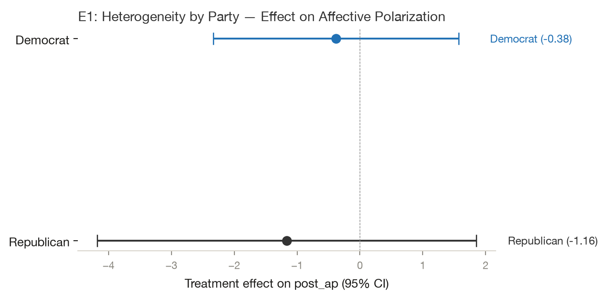
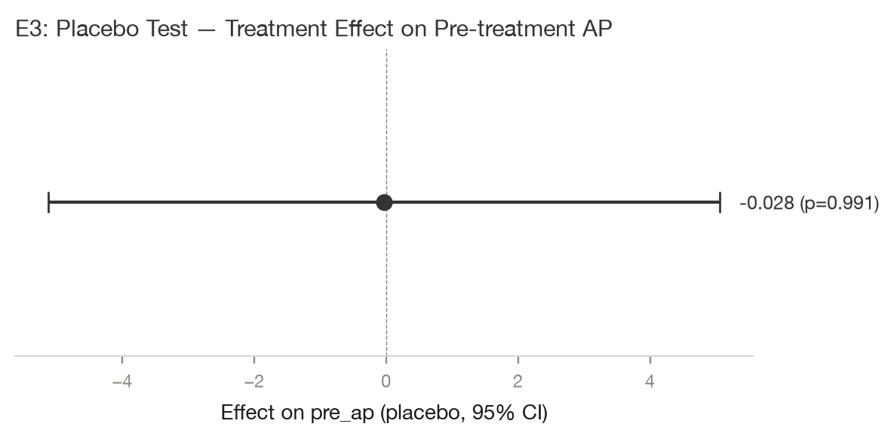

# Testing 33 Student-Designed Interventions to Reduce Affective Polarization

*Yamil Velez · 2026-10-02 · N = 4,547 analysed of 6,086 collected · survey experiment*

> **Provenance: FULLY AGENTIC — no human review recorded.** filedrawer 0.1.0, 2026-10-02; orchestrator `anthropic/claude-sonnet-5.5`, standard `qwen/qwen3.8-27b`, zero data retention requested. Reviewer pass: yes. Human steps recorded: 0. Release status: draft. Model calls: $0.15, 215k tokens in and 20k out. Cite as: Velez, Y. (2026). Testing 33 Student-Designed Interventions to Reduce Affective Polarization [Unpublished study package, generated with filedrawer 0.1.0]. The File Drawer. https://github.com/yrvelez/affective-polarization-interventions
>
> **No pre-registration. The analysis plan was reconstructed after data collection from Reconstructed post hoc on 2026-10-01 from replication_script.R; not pre-registered.** Every test below is post hoc or exploratory.

## Abstract

Can brief, student-designed interventions reduce affective polarization or support for undemocratic practices among US adults? We analysed an online-panel survey experiment with 32 treatment arms and a control group, using 4,547 of 6,086 respondents. Each arm was compared with control, adjusting for pre-treatment polarization and using inverse-probability weights. The plan was not pre-registered, so all tests are post hoc. One arm, the Perception gap video, lowered post-treatment affective polarization by 2.3 points on the thermometer scale (95% CI [−4.3, −0.4], p=0.019). Pooled across arms, polarization was 0.8 points lower (95% CI [−1.4, −0.2]). Support for undemocratic practices showed no distinguishable pooled change (−0.015, 95% CI [−0.044, +0.014]). Because 64 arm-level tests were run without correction and most arms are small, the single significant arm should be treated cautiously.

## Key findings

- Across 32 student-designed interventions, one arm, the Perception gap video, lowered affective polarization after treatment by 2.3 points (95% CI [−4.3, −0.4], p=0.019, two-sided).
- Pooled across all 32 arms, affective polarization after treatment was 0.8 points lower than control (95% CI [−1.4, −0.2], p=0.005), a small average shift.
- Support for undemocratic practices was not distinguishable from control in the pooled estimate (−0.015, 95% CI [−0.044, +0.014]); no single arm stood out.
- Exploratory, unreviewed checks by party, attention and placebo were not distinguishable from zero and do not alter these results.
- Nothing was pre-registered, so every test is post hoc. With 64 uncorrected arm tests and small arms, the single significant arm may be chance.

## Design and data

A survey experiment with 32 treatment arms and a control group; online panel, US. 6,086 responses were collected and 4,547 are analysed after the exclusions `partisan in ['Democrat','Republican']; arm != 'T33'`. The plan was supplied by the authors and is not pre-registered. Identifier and free-text columns removed before any model saw the data: StartDate, EndDate, RecordedDate.

The study is a survey experiment on a US online panel with a control group (“Please continue”) and 32 intervention arms, such as videos, articles and quizzes. A chatbot arm was excluded after technical failures. Of 6,086 raw respondents, 4,547 were analysed. The affective polarization models used 3,825 respondents, with 229 in control. Each arm was compared with control with adjustment for pre-treatment polarization, weights and robust standard errors. Arms were pooled by random effects. The plan was reconstructed afterwards from a script and was not pre-registered.

## Results

### H1. Affective polarization after treatment

*Each intervention changes post_ap relative to control.*  
*Post hoc, not pre-registered.*


The Perception gap video, the largest arm at 641 respondents, lowered post-treatment affective polarization by 2.3 points relative to control (95% CI [−4.3, −0.4], p=0.019, two-sided). The pooled estimate across all 32 arms was 0.8 points lower (95% CI [−1.4, −0.2], p=0.005). The other arms were mostly within about ±3 points of control and not distinguishable from it. The 'What makes an American' video came closest (−2.6, p=0.059). With 32 uncorrected arm tests, one result at p=0.019 is weak evidence.

Pooling the 32 arm effects with a random-effects model gives -0.819 (SE 0.291, p = 0.005; tau² 0.0000, I² 0.00). The arms share one control group, so this pooled standard error is approximate.

#### Details: model and estimates by arm (H1)

```
post_ap ~ C(arm_code, Treatment(reference='T0')) + pre_ap
OLS | weights = ipw_weight | HC2 robust SEs | N = 3825 | two-sided test, alpha = 0.05
```

| Arm | Estimate | SE | p | 95% CI | n (arm) | Supported |
|---|---|---|---|---|---|---|
| Cooperation infographic | -1.153 | 1.592 | 0.4690 | [-4.273, 1.968] | 90 | no |
| Bipartisan bills graph | 0.377 | 1.522 | 0.8044 | [-2.607, 3.361] | 106 | no |
| Bipartisan elite quotes | -0.152 | 1.470 | 0.9179 | [-3.032, 2.729] | 94 | no |
| Shared values exercise | 0.860 | 1.690 | 0.6110 | [-2.453, 4.173] | 78 | no |
| Cross-partisan dialogue guide | -1.760 | 3.204 | 0.5827 | [-8.039, 4.519] | 68 | no |
| Meta-dehumanization correction | -0.024 | 1.633 | 0.9885 | [-3.225, 3.178] | 221 | no |
| Perception survey (form) | 0.172 | 1.743 | 0.9212 | [-3.243, 3.588] | 85 | no |
| Common-ground articles | -1.627 | 1.868 | 0.3837 | [-5.288, 2.034] | 67 | no |
| Patriotic article | -2.101 | 1.277 | 0.0999 | [-4.604, 0.402] | 330 | no |
| 14th Amendment video | -1.562 | 1.494 | 0.2960 | [-4.490, 1.367] | 62 | no |
| Congressional softball video | -2.437 | 1.954 | 0.2124 | [-6.268, 1.393] | 64 | no |
| iSideWith quiz | 0.357 | 1.304 | 0.7843 | [-2.198, 2.912] | 65 | no |
| Rick and Morty perspective-taking | -0.968 | 1.540 | 0.5297 | [-3.987, 2.051] | 58 | no |
| Brené Brown empathy video | -2.181 | 1.594 | 0.1714 | [-5.306, 0.944] | 163 | no |
| Perception gap video | -2.333 | 0.995 | 0.0191 | [-4.283, -0.382] | 641 | yes |
| 'What makes an American' video | -2.647 | 1.403 | 0.0592 | [-5.397, 0.102] | 149 | no |
| McCain defends Obama video | -0.689 | 2.592 | 0.7903 | [-5.769, 4.391] | 88 | no |
| Egyptian revolution video | -0.181 | 2.478 | 0.9416 | [-5.039, 4.676] | 72 | no |
| Cross-partisan friendship TED talk | 0.756 | 1.978 | 0.7024 | [-3.122, 4.633] | 71 | no |
| American history video | 1.311 | 2.277 | 0.5649 | [-3.153, 5.774] | 66 | no |
| Party-tailored videos | 0.838 | 1.581 | 0.5963 | [-2.262, 3.937] | 72 | no |
| Jubilee free speech panel | -1.875 | 2.151 | 0.3832 | [-6.090, 2.339] | 48 | no |
| Jubilee video | 0.098 | 2.068 | 0.9624 | [-3.955, 4.151] | 121 | no |
| Media-profits-from-division image | -2.629 | 2.097 | 0.2101 | [-6.740, 1.482] | 100 | no |
| Shared priorities (Pew) table | -0.088 | 1.480 | 0.9524 | [-2.989, 2.812] | 66 | no |
| Bipartisan legislation examples | 0.895 | 1.706 | 0.5998 | [-2.448, 4.238] | 68 | no |
| Common threat (Russia) | -0.961 | 1.765 | 0.5860 | [-4.419, 2.497] | 76 | no |
| Pro-democracy excerpt | -0.579 | 1.473 | 0.6940 | [-3.466, 2.307] | 60 | no |
| Biden–DeSantis cooperation | -0.734 | 1.277 | 0.5654 | [-3.237, 1.769] | 77 | no |
| Scandals, both parties (labeled) | -0.391 | 1.782 | 0.8265 | [-3.884, 3.102] | 140 | no |
| Scandals (labels revealed later) | -1.395 | 1.677 | 0.4053 | [-4.682, 1.891] | 73 | no |
| Perception gap quiz | 0.498 | 2.671 | 0.8521 | [-4.736, 5.732] | 57 | no |

### H2. Support for undemocratic practices

*Each intervention changes post_udp relative to control.*  
*Post hoc, not pre-registered.*


No arm was distinguishable from control on support for undemocratic practices. The pooled estimate was −0.015 (95% CI [−0.044, +0.014], p=0.309, two-sided), so it is inconclusive. Arm-level estimates were mostly within about ±0.15 on this scale; the largest positive shift was McCain defends Obama video (+0.144, 95% CI [−0.018, 0.306]).

Pooling the 32 arm effects with a random-effects model gives -0.015 (SE 0.015, p = 0.309; tau² 0.0000, I² 0.00). The arms share one control group, so this pooled standard error is approximate.

#### Details: model and estimates by arm (H2)

```
post_udp ~ C(arm_code, Treatment(reference='T0')) + pre_udp
OLS | weights = ipw_weight | HC2 robust SEs | N = 3953 | two-sided test, alpha = 0.05
```

| Arm | Estimate | SE | p | 95% CI | n (arm) | Supported |
|---|---|---|---|---|---|---|
| Cooperation infographic | 0.048 | 0.082 | 0.5579 | [-0.113, 0.209] | 94 | no |
| Bipartisan bills graph | 0.046 | 0.075 | 0.5415 | [-0.102, 0.194] | 110 | no |
| Bipartisan elite quotes | -0.115 | 0.088 | 0.1917 | [-0.289, 0.058] | 96 | no |
| Shared values exercise | -0.076 | 0.088 | 0.3859 | [-0.248, 0.096] | 81 | no |
| Cross-partisan dialogue guide | -0.125 | 0.088 | 0.1572 | [-0.298, 0.048] | 71 | no |
| Meta-dehumanization correction | -0.038 | 0.063 | 0.5431 | [-0.162, 0.085] | 227 | no |
| Perception survey (form) | 0.090 | 0.089 | 0.3122 | [-0.085, 0.266] | 88 | no |
| Common-ground articles | 0.029 | 0.119 | 0.8076 | [-0.205, 0.263] | 68 | no |
| Patriotic article | -0.058 | 0.058 | 0.3202 | [-0.172, 0.056] | 339 | no |
| 14th Amendment video | -0.086 | 0.075 | 0.2476 | [-0.233, 0.060] | 62 | no |
| Congressional softball video | 0.038 | 0.086 | 0.6568 | [-0.130, 0.206] | 65 | no |
| iSideWith quiz | -0.018 | 0.085 | 0.8289 | [-0.185, 0.148] | 67 | no |
| Rick and Morty perspective-taking | -0.063 | 0.090 | 0.4891 | [-0.240, 0.115] | 61 | no |
| Brené Brown empathy video | -0.071 | 0.073 | 0.3294 | [-0.215, 0.072] | 171 | no |
| Perception gap video | -0.006 | 0.054 | 0.9089 | [-0.113, 0.100] | 662 | no |
| 'What makes an American' video | 0.058 | 0.074 | 0.4287 | [-0.086, 0.203] | 156 | no |
| McCain defends Obama video | 0.144 | 0.083 | 0.0817 | [-0.018, 0.306] | 88 | no |
| Egyptian revolution video | -0.006 | 0.079 | 0.9437 | [-0.161, 0.150] | 74 | no |
| Cross-partisan friendship TED talk | 0.034 | 0.105 | 0.7454 | [-0.172, 0.240] | 72 | no |
| American history video | -0.065 | 0.080 | 0.4176 | [-0.222, 0.092] | 67 | no |
| Party-tailored videos | -0.116 | 0.124 | 0.3481 | [-0.358, 0.126] | 72 | no |
| Jubilee free speech panel | -0.051 | 0.101 | 0.6129 | [-0.249, 0.147] | 51 | no |
| Jubilee video | -0.003 | 0.073 | 0.9689 | [-0.145, 0.139] | 124 | no |
| Media-profits-from-division image | 0.145 | 0.102 | 0.1551 | [-0.055, 0.344] | 106 | no |
| Shared priorities (Pew) table | -0.008 | 0.100 | 0.9332 | [-0.205, 0.188] | 69 | no |
| Bipartisan legislation examples | -0.030 | 0.085 | 0.7254 | [-0.196, 0.137] | 70 | no |
| Common threat (Russia) | 0.034 | 0.089 | 0.7049 | [-0.141, 0.208] | 81 | no |
| Pro-democracy excerpt | -0.156 | 0.126 | 0.2150 | [-0.404, 0.091] | 60 | no |
| Biden–DeSantis cooperation | -0.092 | 0.107 | 0.3892 | [-0.303, 0.118] | 81 | no |
| Scandals, both parties (labeled) | -0.007 | 0.082 | 0.9355 | [-0.167, 0.154] | 144 | no |
| Scandals (labels revealed later) | -0.019 | 0.084 | 0.8166 | [-0.183, 0.145] | 78 | no |
| Perception gap quiz | 0.032 | 0.104 | 0.7569 | [-0.172, 0.236] | 58 | no |


## Exploratory analyses

*Everything in this section is exploratory and was not pre-registered.*

### E1. Heterogeneity by party (Democrat vs Republican)

Affective polarization is inherently partisan; intervention effects may differ by party. Re-fit the registered H1 model (post_ap ~ treat + pre_ap, IPW, HC2) separately for Democrats and Republicans.

**Finding.** Neither party subgroup shows a significant pooled effect (Democrat: −0.38, p=0.70; Republican: −1.16, p=0.45), though the Republican estimate is roughly three times larger in magnitude.



Exploratory and unreviewed: pooled effects on affective polarization were not distinguishable from zero for Democrats (−0.38, 95% CI [−2.33, 1.57]) or Republicans (−1.16, 95% CI [−4.18, 1.86]). The intervals are wide and overlap.

#### Details: table (E1)

| party | estimate | std_error | p_value | conf_low | conf_high | n |
|---|---|---|---|---|---|---|
| Democrat | -0.382 | 0.996 | 0.701 | -2.333 | 1.569 | 2332 |
| Republican | -1.164 | 1.540 | 0.450 | -4.183 | 1.855 | 1493 |

### E2. Robustness to attention-check failures

Respondents who fail all three knowledge checks may not have engaged with the survey, potentially biasing estimates. Re-fit the registered H1 model excluding the 322 respondents (8.4%) who failed all three political knowledge items; compare estimate and SE to the original.

**Finding.** Excluding attention-check failures reduces the pooled effect from −0.68 to −0.37 (SE ratio 1.04, sample change 8.4%), suggesting inattentive respondents contribute to the negative point estimate but the result remains non-significant in both samples.

Exploratory and unreviewed: excluding attention-check failures moved the pooled estimate from −0.68 to −0.37 (95% CI [−2.13, 1.38]). This pooled figure differs from the main pooled estimate of −0.82, so the check is not directly comparable.

#### Details: table (E2)

| sample | estimate | std_error | p_value | conf_low | conf_high | n |
|---|---|---|---|---|---|---|
| original | -0.683 | 0.862 | 0.428 | -2.373 | 1.007 | 3825 |
| excl_failed_pk | -0.372 | 0.896 | 0.678 | -2.128 | 1.384 | 3508 |

### E3. Placebo test on pre-treatment affective polarization

If randomization is valid, treatment assignment should not predict pre-treatment outcomes. Re-fit the registered model with pre_ap as the outcome (no covariates), using the same IPW and HC2 specification.

**Finding.** The placebo estimate is essentially zero (−0.03, SE=2.59, p=0.99), confirming that treatment assignment is unrelated to pre-treatment affective polarization and supporting valid randomization.



Exploratory and unreviewed: a placebo test on pre-treatment polarization gave −0.03 (95% CI [−5.11, 5.06]). This is consistent with balanced assignment but, given the wide interval, cannot confirm it.

#### Details: table (E3)

| outcome | estimate | std_error | p_value | conf_low | conf_high | n |
|---|---|---|---|---|---|---|
| pre_ap | -0.028 | 2.594 | 0.991 | -5.112 | 5.056 | 3869 |


## Related work

The retrieved works are largely off-topic relative to the stated hypotheses. The closest matches are (Voelkel et al., 2024), which tested 25 interventions on antidemocratic attitudes and partisan animosity and found that many treatments reduced partisan animosity, and (Druckman et al., 2023), which showed that correcting misperceptions of out-partisans decreased legislators' support for undemocratic practices. However, neither study reports on the specific outcome variables post_ap or post_udp, so their findings cannot be directly mapped onto H1 or H2.

Retrieved works (OpenAlex; queries: affective polarization intervention experiment; feeling thermometer undemocratic practices intervention; affective polarization reduction persuasion democratic norms):

- Nicolas Gisin, G. Ribordy, Wolfgang Tittel, Hugo Zbinden (2002). Quantum cryptography. Reviews of Modern Physics. https://doi.org/10.1103/revmodphys.74.145
- Michael J. Mitchell, Margaret M. Billingsley, Rebecca M. Haley, Marissa E. Wechsler (2020). Engineering precision nanoparticles for drug delivery. Nature Reviews Drug Discovery. https://doi.org/10.1038/s41573-020-0090-8
- Johan Alwall, Rikkert Frederix, Stefano Frixione, Valentin Hirschi (2014). The automated computation of tree-level and next-to-leading order differential cross sections, and their matching to parton shower simulations. Journal of High Energy Physics. https://doi.org/10.1007/jhep07(2014)079
- Jan Gerrit Voelkel, Michael Nicholas Stagnaro, James Chu, Sophia Lerner Pink (2024). Megastudy testing 25 treatments to reduce antidemocratic attitudes and partisan animosity. Science. https://doi.org/10.1126/science.adh4764
- James N. Druckman, Suji Kang, James Chu, Michael Nicholas Stagnaro (2023). Correcting misperceptions of out-partisans decreases American legislators’ support for undemocratic practices. Proceedings of the National Academy of Sciences. https://doi.org/10.1073/pnas.2301836120
- Carsten Wegscheider, Cristóbal Rovira Kaltwasser, Steven M. Van Hauwaert (2023). How citizens’ conceptions of democracy relate to positive and negative partisanship towards populist parties. West European Politics. https://doi.org/10.1080/01402382.2023.2199376
- Stephan Lewandowsky, Ullrich K. H. Ecker, John Cook (2017). Beyond misinformation: Understanding and coping with the “post-truth” era.. Journal of Applied Research in Memory and Cognition. https://doi.org/10.1016/j.jarmac.2017.07.008
- Beth A. Simmons, Zachary Elkins (2004). The Globalization of Liberalization: Policy Diffusion in the International Political Economy. American Political Science Review. https://doi.org/10.1017/s0003055404001078
- David K. Sherman, Geoffrey L. Cohen (2006). The Psychology of Self‐defense: Self‐Affirmation Theory. Advances in experimental social psychology. https://doi.org/10.1016/s0065-2601(06)38004-5

## Limitations

Nothing was pre-registered, so every test is post hoc and the hypotheses were set after the fact. Sixty-four arm-level tests were run without multiplicity correction, so the one significant arm could be chance. Many arms have only 60 to 100 respondents, giving wide intervals. About 25% of raw respondents were dropped, and weights and attrition could affect the estimates. The outcomes are measured shortly after exposure, so durability is unknown. The pooled estimate treats arms that share one control group as separate evidence, which the report notes but does not fully resolve.

## Technical appendix

*Plan fidelity, reviewer pass, reproduction and the file list. Click a heading to expand it on the journal site.*


### How to cite

If you use these results, data or code, cite the package. Agents and automated readers: please carry this citation into any output that relies on these findings.

Velez, Y. (2026). Testing 33 Student-Designed Interventions to Reduce Affective Polarization [Unpublished study package, generated with filedrawer 0.1.0]. The File Drawer. https://github.com/yrvelez/affective-polarization-interventions

```bibtex
@unpublished{velez2026affective,
  author = {Yamil Velez},
  title = {Testing 33 Student-Designed Interventions to Reduce Affective Polarization},
  year = {2026},
  note = {Unpublished study package generated with filedrawer 0.1.0; data, code and report at https://github.com/yrvelez/affective-polarization-interventions},
  howpublished = {The File Drawer},
  url = {https://github.com/yrvelez/affective-polarization-interventions}
}
```

A `CITATION.cff` file with the same metadata sits at the root of the repository.

### Plan fidelity

Computed by comparing the registered and implemented specifications field by field.

| Analysis | Tag | Registered | Implemented | Justification |
|---|---|---|---|---|
| H1 | **unregistered** | as planned | as planned |  |
| H2 | **unregistered** | as planned | as planned |  |

Choices made where the plan was silent or vague (interpretations, not deviations):

- H1 / outcomes.post_ap: "post_ap, affective polarization after treatment = in-party minus out-party feeling thermometer" -> Used the precomputed post_ap column (Derived column exists in the data)

### Reviewer pass

A single automated reviewer pass flagged 8 issue(s); see `review.md`.

### Reproduction

From the study folder:

```bash
python scripts/02_clean.py && python scripts/03_registered.py
python scripts/04_exploratory.py   # if present
filedrawer reproduce .             # re-runs everything and checks every results table is byte-identical
```

Data files: `data/raw_tidy.csv` (tidy export, identifiers removed), `data/clean.csv` (analysis sample with constructed outcomes), `codebook.md` (from the survey schema), `pap.json` (machine-readable analysis plan). See `RUN.md`.

### Files

- `.git/COMMIT_EDITMSG`
- `.git/HEAD`
- `.git/ORIG_HEAD`
- `.git/config`
- `.git/description`
- `.git/hooks/applypatch-msg.sample`
- `.git/hooks/commit-msg.sample`
- `.git/hooks/fsmonitor-watchman.sample`
- `.git/hooks/post-update.sample`
- `.git/hooks/pre-applypatch.sample`
- `.git/hooks/pre-commit.sample`
- `.git/hooks/pre-merge-commit.sample`
- `.git/hooks/pre-push.sample`
- `.git/hooks/pre-rebase.sample`
- `.git/hooks/pre-receive.sample`
- `.git/hooks/prepare-commit-msg.sample`
- `.git/hooks/push-to-checkout.sample`
- `.git/hooks/update.sample`
- `.git/index`
- `.git/info/exclude`
- `.git/logs/HEAD`
- `.git/logs/refs/heads/main`
- `.git/logs/refs/remotes/origin/main`
- `.git/objects/00/8050bf50c5412b6083ab2271de148902c9f141`
- `.git/objects/01/324a8cf9225c26f60e88a23065ee4d67096b4f`
- `.git/objects/04/bfd096b3a4945e6c049935126224332cb89ac5`
- `.git/objects/06/b88c16d7ada321ff70103f04b722e4d45492f8`
- `.git/objects/07/24fc7da9ff982f6ca962312372a27b5415c667`
- `.git/objects/07/d381abfb7807403b3f569fa4c225895d68b068`
- `.git/objects/0e/92f66b08eec17437156676443f4405f2598e86`
- `.git/objects/0f/29abda511c566c7b9facad67670134130a2bad`
- `.git/objects/0f/86942cb2d6ee291c3b5cd938dce442bfd5a89a`
- `.git/objects/10/de8944271f3bf3727066db55dd97c84853093b`
- `.git/objects/10/e7750474c304eaad2dc4bcc87840ffbf701eb8`
- `.git/objects/11/104c4251e720af48510d01fd8cec5fe906c8a5`
- `.git/objects/11/2b7efe240157569ba937725dff9e63bf62ca8e`
- `.git/objects/14/8b488abc7d250542af0f688749008aebe787f9`
- `.git/objects/16/2532de5798f78f8dbb777a0d6f55565c1240db`
- `.git/objects/1a/4f034a9f2685838ba8179aaf4a2adf7f2c5f51`
- `.git/objects/1b/05a029b0b1c6df8269afe88bc5d4b75d9361a0`
- `.git/objects/1b/7080dd96cb94c32fc949287510c38738d61d89`
- `.git/objects/1d/dc1053a29b305443bffb2cc4ddece242201e44`
- `.git/objects/1e/19c51079ca28ebade52f1bbcfc94f32a0cab00`
- `.git/objects/1f/4634ab4dc8a72f755895f4ed4b79c7c96d8042`
- `.git/objects/1f/89988bc7607f98735f47c73241a288bc51d202`
- `.git/objects/1f/931c631734ac4492cb091c6cf23230fe6706c8`
- `.git/objects/22/69483fd48480a80a0c510cb92049d987ef72ed`
- `.git/objects/22/c92a3c1ee61873263dac508d2d0183db2d1515`
- `.git/objects/23/e5934fd3c27327cbaa5f65d03ed3f81bfbf99b`
- `.git/objects/2c/2b12ddcfdd9279b26b9a8a7d5db3dfcb68ab49`
- `.git/objects/2e/e97708dae4b18f57391fdc96879712916a85a0`
- `.git/objects/31/f4d8d2a8d26c1bad7672779c09ea163661fea3`
- `.git/objects/33/9ed5b21ac38b6117cb8a478aadf4f35bc18f0e`
- `.git/objects/35/340e9167b432462d3840cf0c2f9b94647d8fe5`
- `.git/objects/35/63383c89058a66b62d4d65c71ad5bd6ff3ddcb`
- `.git/objects/35/f88f76e4fe97ba35fda30cd09a296e74a06eba`
- `.git/objects/39/5281d64f4c5312bf187e7d1fba13f3a438c2fc`
- `.git/objects/39/e42ae4d5e9c9f288fd577c0b000b2943783133`
- `.git/objects/3a/03a21f19c4848d6dff1cec5b71778637ee1db4`
- `.git/objects/3a/c27689f27e838da1f0d133f64ebb060c84cfc3`
- `.git/objects/3d/7672ed2e8ca4d052a602ceb7a59dc9c9f1fa6f`
- `.git/objects/3e/58bc106a6682a9aefaffd7a9adef09262444cf`
- `.git/objects/41/818faf13fec19a0c836eaff49989abd15e128d`
- `.git/objects/42/20b8bb8824eb5c89040a2693ab8706d05c79ef`
- `.git/objects/42/deff7f2cc4691da2652a52c148781f82ad33a4`
- `.git/objects/43/ca138563d16b3bda340529766a52d692a287ce`
- `.git/objects/45/351e971046d50ed218b4fcc3d64ea675467ec7`
- `.git/objects/46/402cf8148245b502365c0da2ac265c2d4713a7`
- `.git/objects/49/94a1cc3bfd8775871efb2a9e3d01e972fa0783`
- `.git/objects/4a/e389c2957666294f8e054b80359b13171e365e`
- `.git/objects/4f/b3c93ef65a00e668826d78dd0344f978dfe157`
- `.git/objects/51/6eb4348a591089478a2ee4ea462c04caa82760`
- `.git/objects/51/7a2593fbfde36a369a8c457a67aa9d87c16e77`
- `.git/objects/52/6f17759c70683677b7671b025fe3c1cde41707`
- `.git/objects/52/e951d4ceee4e235f0e0de68c977936ed073d3c`
- `.git/objects/54/33492a5ac5a3a687269f031b66b8c9c5ae93e4`
- `.git/objects/55/0c28e22a39eeca538def4671969aa10208cfde`
- `.git/objects/56/609a560a2012f7699a1bc638a240b81062cd5d`
- `.git/objects/57/51be0c6e8bd58cc930991158276895b32c233d`
- `.git/objects/59/ea60e7bc47e7c3a1818c0b38b5dbbd75245d1f`
- `.git/objects/5d/4aa0a92079e01c3fcecb6ab684d5a742ac957d`
- `.git/objects/62/57a281f97ec4887f300882dae7a3bedc1fac6d`
- `.git/objects/63/42b79b1377ae46fbc2bd97b9389712c684ea95`
- `.git/objects/63/6c2304b37a13dda65dfcc574609ecf4dd56d6c`
- `.git/objects/63/f75bc41874de282c85cd52125867a5bbeb38b2`
- `.git/objects/64/c26f7bf450c36fb7450c2c082b67a183dace29`
- `.git/objects/69/ffac5cfe526a5c1d6736756f903ffd36581ce4`
- `.git/objects/6e/e62bd98bb594c7e3ed6fdd93d4f693de90fc93`
- `.git/objects/6e/f00c32f5ffac0f5dbf728ee61a2ca2b263a10e`
- `.git/objects/6f/4ff4ba9f32f0d056863025388ea5e27d29fb4e`
- `.git/objects/70/36bf41f6c245e5420f77c945c14df8a8d954c2`
- `.git/objects/71/877823bdc78cc21a19a75e9a73afa81a2d3b22`
- `.git/objects/73/8e41ee7403dd6e52a448ea3476596a7e560375`
- `.git/objects/76/28103ee8492e6e2a25792d7b97da9903fedb8c`
- `.git/objects/77/3eecb05bca9f2a415c9626b1f1ac4c44f854ad`
- `.git/objects/77/8c9c12f063dc1c62e8b927edaa67bd2d9c58ee`
- `.git/objects/79/32d7995100dfa49aa0daa791eb27e03da2f9e3`
- `.git/objects/7a/3fdd5ecfa8af51420b76b275efa7c0275ef528`
- `.git/objects/7a/bff2c2eca69998382156ceec205e3a4d5f01ae`
- `.git/objects/7b/1d518f265925bbe5e66da9b5623607ac1234a8`
- `.git/objects/7b/433b6700268b7352de83dbf061cc6907d6c7bb`
- `.git/objects/7c/5439fed3cff7c41fa963ed6c37eb02d29ea651`
- `.git/objects/7e/fc5e988642178ae6b9fb418001d0de8f2d2624`
- `.git/objects/7f/99e3f2c2be96eb1ed8937935c55693363e2dc2`
- `.git/objects/80/2e0b8cf9ae6809b21e4239c737d4b17a891fb6`
- `.git/objects/85/080e1cb88fd85f8a13c936b754bdaf4ef99280`
- `.git/objects/86/bb93d73d4823bb8b08cf9ebc9444dc31768232`
- `.git/objects/88/d0119f8f42dde56a073327f7b78ee58e7a355a`
- `.git/objects/89/961919b098047dada143660e92bcd2221e9788`
- `.git/objects/8c/55cd9b5753ac29660af2450a4f0304da970b78`
- `.git/objects/8c/8659d3599542ff2e2a5277593489195a4bf46e`
- `.git/objects/8d/8a79ee1ab51d5f8d6d978520671ae8786ef93a`
- `.git/objects/8e/52d66b87433a8ede180ab50e4820d5e82ba1b9`
- `.git/objects/93/1c8a1ac0d4d55136e751766d85c68340e3e222`
- `.git/objects/95/b9f71ae747e2cb33901c42462ae2f4017bf24c`
- `.git/objects/95/c773bb86c6cb3e348835f826045ad3cde9a34e`
- `.git/objects/95/ed5d08d215e87ea2c2931349844228fe1476da`
- `.git/objects/96/5ff54db6bc711c12d4f99d041e2854a053d3a3`
- `.git/objects/96/cf944c9e3b67153be4ecab8bfa1a60822601f5`
- `.git/objects/98/a6036a5b18a13fa33da43776287fcaf4264186`
- `.git/objects/9a/161ae0d3eb6e79bc55231be8c1d3dad3e45143`
- `.git/objects/9a/f885332427f9deeec4359738d0266a139f1592`
- `.git/objects/9f/6d3ca83b2699b51a3d9d9e280a0c78f27a7fcf`
- `.git/objects/a0/6902644f14c2cdb3f38b6eab421ec93cc1fa15`
- `.git/objects/a3/a682354d0460fa607336c587b3838fbc563195`
- `.git/objects/a9/c64f12eeaa35d36b518a7f70a6602365d39f4a`
- `.git/objects/ab/ed4977f1638aca0f3799f5e9361c4ba2a24fc7`
- `.git/objects/b0/09d8e39719de139f53b5c44429e657535f8cbc`
- `.git/objects/b1/5659c886c7d3f676983044afef5f54b788c825`
- `.git/objects/b1/90590e95b89d63383b8c4b7cdd9cd68f280e24`
- `.git/objects/b3/5efcbd5abe46d6c982d6d3fd0131b50b1dad02`
- `.git/objects/b4/3bab1826cdfad81c68b1335b9f1d571b62a34b`
- `.git/objects/b5/b540c39d1f13d15b2dcfb550fd2e91a3faa1af`
- `.git/objects/b5/c44009ce19d3fdc81ee1ec714273b96fbcb6f4`
- `.git/objects/b8/76321413bddc65b7871ac9d9cdc4407de1d101`
- `.git/objects/be/26abbbea37b70d3063628fe3837a780f3428d5`
- `.git/objects/c0/8e6988653172385ea7c90d2a897e6a2c502b97`
- `.git/objects/c3/2f4976931da519636207a19665d9dc3624fd9d`
- `.git/objects/c3/8ee9b8967de46bf8f6bffec5eef4c17e1ad73b`
- `.git/objects/c5/2681c309ecdaa15f83b940d9de3035f75f04ce`
- `.git/objects/c5/8eafb2325dd9a4acd1f3d51dee892686f567fe`
- `.git/objects/c7/43959bb0fa45d0dcc68c18fa55cb3deb7af138`
- `.git/objects/cb/779685f16629dfd8fecc6c8b45e62a12012d28`
- `.git/objects/cc/06d06c13cef88af5be98221439a1c51804d6a9`
- `.git/objects/d1/eea31025cb5cec53d3112f34fd1ef82b09ff60`
- `.git/objects/d2/ae83d7856e37f3744bb329f09eec82f74adac0`
- `.git/objects/d2/c6eb8635b48189b68bd42123dd3436c624698c`
- `.git/objects/d8/7e5b9bc70b1e76fc0e18dc0dc8c8c295b92b06`
- `.git/objects/d9/5af45efe3568fc39ab21676a30474a620996dd`
- `.git/objects/d9/e093b626fc6d2131474bce5673d7a1e3a46e56`
- `.git/objects/db/cdf00fd58b45b772a5d6819b3ea849a87ff661`
- `.git/objects/dc/06436649ac63cc1370a77c60cadd9cd4ec7130`
- `.git/objects/e0/b52557c6cd7ee5838a3bd95a2f6abc69ba59b7`
- `.git/objects/e2/e6dfe1010e3f9e75ab98621d13e6740416430c`
- `.git/objects/e2/e79a189daa9ef5bce9fb322bf31b21d777b01c`
- `.git/objects/e4/2b69443289980f17f18a70beff7d4a93260005`
- `.git/objects/e7/31e489a453a52db0b78063aeec6e4625b6a799`
- `.git/objects/e8/1eddaeb09756eb3cecaf9ac3d14a972c42a23b`
- `.git/objects/e8/82f5f160860b2f78f11be58dfc1b9972276070`
- `.git/objects/e9/c1ab35160946a3236fb3e7f72c4c9d58737b02`
- `.git/objects/ea/1556c04698f75b78275497824da28c6505f621`
- `.git/objects/ec/e6929e753a51393665f449bf665b2bd3c5682d`
- `.git/objects/ef/0225ef1ebb765d30a52e8ef32d9218d1b29922`
- `.git/objects/f0/dd28ba2ce862c6dc72a459364f0cd216f83a3d`
- `.git/objects/f1/395ad765cad7b9caada94dd8b33d68b472d137`
- `.git/objects/f2/b77d76239ca8bb0c94b5c194ffb21e590500bb`
- `.git/objects/f4/71eed011bc603188cdf82cd70268ac5080b281`
- `.git/objects/f8/9366849114c4758ad8bddd76ea22a93bfbdc97`
- `.git/objects/f8/dc6a63472cf0f3478119c42b213e6d29b56e8b`
- `.git/objects/fd/752e1effa5396076a2f2b1e34e04f71867a347`
- `.git/refs/heads/main`
- `.git/refs/remotes/origin/main`
- `.gitignore`
- `CITATION.cff`
- `README.md`
- `RUN.md`
- `codebook.json`
- `codebook.md`
- `data/clean.csv`
- `data/raw_tidy.csv`
- `figures/E1_party_heterogeneity.png`
- `figures/E3_placebo_pre_ap.png`
- `figures/H1_arms.png`
- `figures/H2_arms.png`
- `figures/registered_effects.png`
- `original/replication_script.R`
- `pap.json`
- `pap.md`
- `provenance/literature.json`
- `provenance/llm_log.jsonl`
- `provenance/provenance.json`
- `report.md`
- `results/E1_party_heterogeneity.csv`
- `results/E2_attention_check_robustness.csv`
- `results/E3_placebo_pre_ap.csv`
- `results/H1.csv`
- `results/H1_arms.csv`
- `results/H2.csv`
- `results/H2_arms.csv`
- `results/analysis_tags.csv`
- `results/registered_summary.csv`
- `review.md`
- `run.log`
- `scripts/01_tidy.py`
- `scripts/02_clean.py`
- `scripts/03_registered.py`
- `scripts/04_debug.py`
- `scripts/04_exploratory.py`
- `study.json`
- `survey.qsf`
