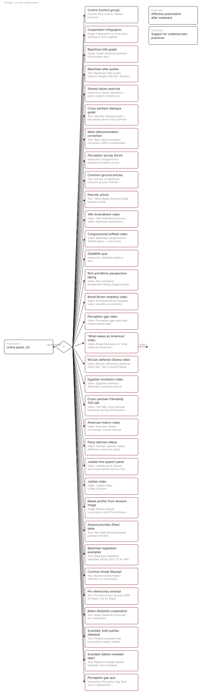
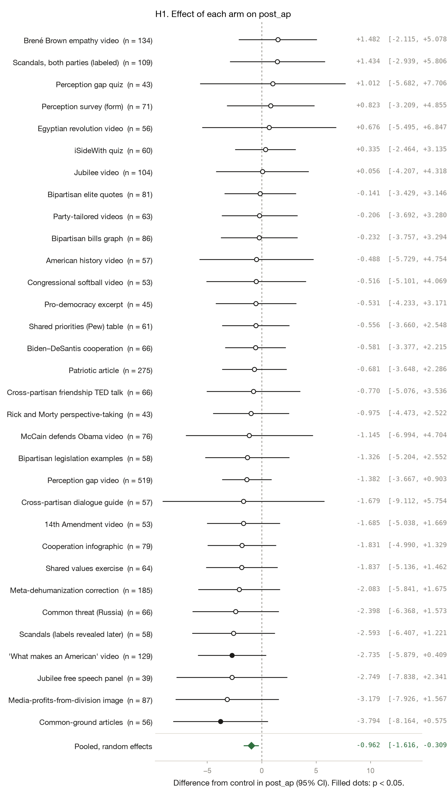
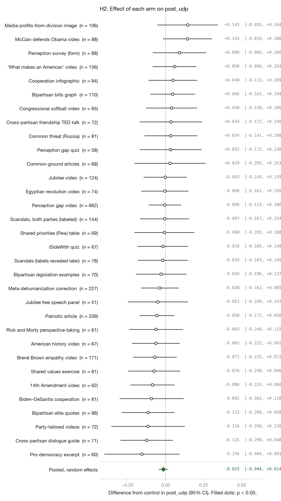
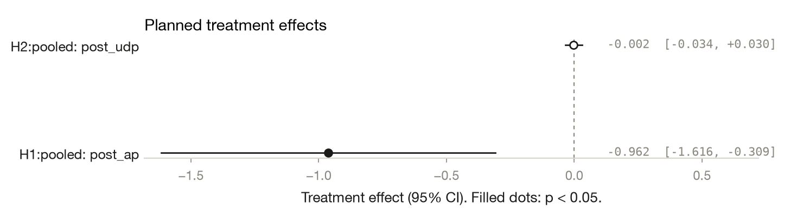
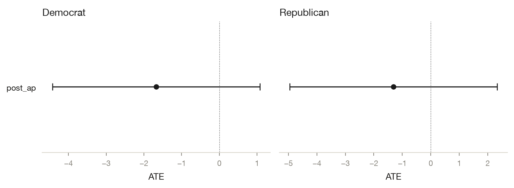
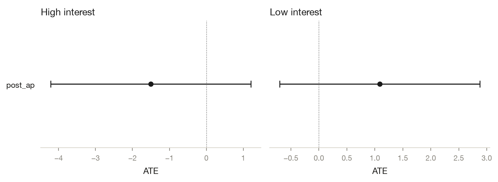

# Testing 33 Student-Designed Interventions to Reduce Affective Polarization

*Yamil Velez · 2026-10-07 · N = 4,547 analysed of 6,086 collected · survey experiment*

<!-- fd:badges -->
      

> **Provenance: FULLY AGENTIC — no human review recorded.** filedrawer 0.1.0, 2026-10-07; orchestrator `anthropic/claude-sonnet-5.5`, standard `qwen/qwen3.8-27b`, zero data retention requested. Reviewer pass: yes. Human steps recorded: 0. Release status: draft. Model calls: $0.80, 340k tokens in and 53k out. Cite as: Velez, Y. (2026). Testing 33 Student-Designed Interventions to Reduce Affective Polarization [Unpublished study package, generated with filedrawer 0.1.0]. The File Drawer. https://github.com/yrvelez/affective-polarization-interventions
>
> **No pre-registration. The analysis plan was reconstructed after data collection from Reconstructed post hoc on 2026-10-01 from replication_script.R; not pre-registered.** Every test below is post hoc or exploratory.

<!-- fd:section id=abstract -->
## Abstract

Can brief, student-designed interventions reduce affective polarization? We analyse a US online-panel survey experiment in which respondents were randomly assigned to a control condition or to one of 32 interventions (videos, articles, images, quizzes); a 33rd arm, a chatbot, was excluded. Outcomes were post-treatment affective polarization on a feeling-thermometer scale and support for undemocratic practices on an attitude scale. Of 6,086 respondents, 4,547 entered the analysis. The Perception gap video lowered affective polarization by 2.3 points relative to control (95% CI [−4.3, −0.4], p = 0.019). The pooled average effect was small and fragile: −0.819 (p = 0.005) under random-effects pooling, but −0.683 (p = 0.428) with a single pooled treatment term. No arm was distinguishable from control on support for undemocratic practices (pooled −0.015, 95% CI [−0.044, +0.014]). The study was not pre-registered, so every test is post hoc, and the 64 tests were uncorrected for multiplicity.

<!-- fd:section id=findings -->
## Key findings

- Of 32 interventions, the Perception gap video was the only arm with an interval excluding zero on affective polarization: −2.3 points (95% CI [−4.3, −0.4], p = 0.019, two-sided). The result is post hoc and uncorrected.
- The pooled average shift in affective polarization depends on the method: −0.8 points under random-effects pooling (p = 0.005), but −0.7 (p = 0.428) with a single pooled treatment term. It is small and fragile.
- Support for undemocratic practices was not distinguishable from control in any single arm; the pooled estimate was −0.015 (95% CI [−0.044, +0.014]).
- Exploratory, unreviewed subgroup estimates by party and political interest for affective polarization were each indistinguishable from zero; no formal test of group differences was run.
- The plan was not pre-registered and 64 tests were uncorrected, so the one arm with an interval excluding zero may be a chance finding; many arms are small.

<!-- fd:section id=design -->
## Design and data

A survey experiment with 32 arms and a control group; online panel, US. 6,086 responses were collected and 4,547 are analysed after the exclusions `partisan in ['Democrat','Republican']; arm != 'T33'`. The plan was supplied by the authors and is not pre-registered. Identifier and free-text columns removed before any model saw the data: RecordedDate, dem_intervention, rep_intervention.



#### Details: the design in words

A survey experiment on online panel respondents in US (N = 4,547 analysed). Respondents are randomly assigned to 33 arms: Cooperation infographic, Bipartisan bills graph, Bipartisan elite quotes, Shared values exercise, Cross-partisan dialogue guide, Meta-dehumanization correction, Perception survey (form), Common-ground articles, Patriotic article, 14th Amendment video, Congressional softball video, iSideWith quiz, Rick and Morty perspective-taking, Brené Brown empathy video, Perception gap video, 'What makes an American' video, McCain defends Obama video, Egyptian revolution video, Cross-partisan friendship TED talk, American history video, Party-tailored videos, Jubilee free speech panel, Jubilee video, Media-profits-from-division image, Shared priorities (Pew) table, Bipartisan legislation examples, Common threat (Russia), Pro-democracy excerpt, Biden–DeSantis cooperation, Scandals, both parties (labeled), Scandals (labels revealed later), Perception gap quiz, against the control group Control. Cooperation infographic: Image: Infographic on Americans wanting to work together Bipartisan bills graph: Image: Graph showing bipartisan bill passage rates Bipartisan elite quotes: Text: Bipartisan elite quotes (Obama, Reagan, McCain, Sanders, Trump, Clinton) Shared values exercise: Interactive: Values elicitation + policy support statistics by party Cross-partisan dialogue guide: Text: Abortion dialogue guide + docuseries about cross-partisan talks Meta-dehumanization correction: Text: Meta-dehumanization correction (300% overestimate statistic) Perception survey (form): Interactive: Google Forms political perception survey Common-ground articles: Text: Articles on bipartisan common ground (TheHill + PublicConsultation) Patriotic article: Text: 'What Makes America Great' patriotic article 14th Amendment video: Video: 14th Amendment privacy rights: bipartisan implications (abortion, vaccines, data) Congressional softball video: Video: Bipartisan congressional softball game + cross-party cooperation videos iSideWith quiz: Interactive: iSideWith political quiz Rick and Morty perspective-taking: Video: Rick and Morty perspective-taking: imagine being opposite party member Brené Brown empathy video: Video: RSA Brené Brown empathy video: empathy vs sympathy Perception gap video: Video: Perception gap video with misperception data 'What makes an American' video: Video: Street interviews on 'what makes an American' + superordinate identity McCain defends Obama video: Video: McCain defending Obama at 2008 rally: 'He's a decent family man' Egyptian revolution video: Video: Egyptian revolution aftermath: cautionary tale of polarization Cross-partisan friendship TED talk: Video: Ted Talk: cross-partisan friendship during 2016 election American history video: Video: American history chronology: shared national heritage Party-tailored videos: Video: Partisan-specific videos (different content by party) Jubilee free speech panel: Video: Jubilee panel: liberals and conservatives discuss free speech Jubilee video: Video: Jubilee video (J7We_PYASzc) Media-profits-from-division image: Image: Media critique: corporations profit from division Shared priorities (Pew) table: Text: Pew table showing shared partisan priorities Bipartisan legislation examples: Text: Bipartisan legislation examples (NCLB, ACA, TCJA, IRA) Common threat (Russia): Text: Russia nuclear threat + reflection on cross-party reliance Pro-democracy excerpt: Text: Pro-democracy excerpt (CNN for Dems, Fox for Reps) Biden–DeSantis cooperation: Text: Biden-DeSantis Hurricane Ian cooperation Scandals, both parties (labeled): Text: Political scandals from both parties (labels visible) Scandals (labels revealed later): Text: Political scandals (labels redacted, then revealed) Perception gap quiz: Interactive: Perception Gap Quiz 'as an independent' Outcomes: Affective polarization after treatment, Support for undemocratic practices.


The study was reconstructed post hoc from a replication script and was not pre-registered, so every test here is post hoc. Respondents were assigned to a pure control ("Please continue") or one of 32 interventions; a GPT-3 chatbot arm was excluded after technical failures. Of 6,086 raw respondents, 4,547 were analysed; some rows dropped for missing outcomes. In H1, arms ranged from roughly 48 to 330 respondents, except the Perception gap video (641 in H1, 662 in H2). Each arm is compared with control. P-values are two-sided and uncorrected.

<!-- fd:section id=results -->
## Results

<!-- fd:hyp id=H1 tag=unregistered outcome=post_ap -->
### H1. Affective polarization after treatment

*Each intervention changes post_ap relative to control.*  
*Post hoc, not pre-registered.*



The Perception gap video was the only arm with an interval excluding zero. It left respondents 2.3 points lower on the affective polarization thermometer than control (95% CI [−4.3, −0.4], two-sided p = 0.019). It is also the largest arm, with 641 respondents. The 'What makes an American' video had a similar estimate, −2.6 points (95% CI [−5.4, 0.1], p = 0.059), with a wider interval. The remaining arms were not distinguishable from control. The pooled random-effects estimate was −0.819 (p = 0.005; the interval [−1.4, −0.2] is derived from the standard error), but a single pooled treatment term gave −0.683 (p = 0.428), so the average shift is small and method-dependent.

Pooling the 32 arm effects with a random-effects model gives -0.819 (SE 0.291, p = 0.005; tau² 0.0000, I² 0.00). The arms share one control group, so this pooled standard error is approximate.

#### Details: model and estimates by arm (H1)

```
post_ap ~ C(arm_code, Treatment(reference='T0')) + pre_ap
OLS | weights = ipw_weight | HC2 robust SEs | N = 3825 | two-sided test, alpha = 0.05
```

| Arm | Estimate | SE | p | 95% CI | n (arm) | Supported |
|---|---|---|---|---|---|---|
| Cooperation infographic | -1.153 | 1.592 | 0.4690 | [-4.273, 1.968] | 90 | no |
| Bipartisan bills graph | 0.377 | 1.522 | 0.8044 | [-2.607, 3.361] | 106 | no |
| Bipartisan elite quotes | -0.152 | 1.470 | 0.9179 | [-3.032, 2.729] | 94 | no |
| Shared values exercise | 0.860 | 1.690 | 0.6110 | [-2.453, 4.173] | 78 | no |
| Cross-partisan dialogue guide | -1.760 | 3.204 | 0.5827 | [-8.039, 4.519] | 68 | no |
| Meta-dehumanization correction | -0.024 | 1.633 | 0.9885 | [-3.225, 3.178] | 221 | no |
| Perception survey (form) | 0.172 | 1.743 | 0.9212 | [-3.243, 3.588] | 85 | no |
| Common-ground articles | -1.627 | 1.868 | 0.3837 | [-5.288, 2.034] | 67 | no |
| Patriotic article | -2.101 | 1.277 | 0.0999 | [-4.604, 0.402] | 330 | no |
| 14th Amendment video | -1.562 | 1.494 | 0.2960 | [-4.490, 1.367] | 62 | no |
| Congressional softball video | -2.437 | 1.954 | 0.2124 | [-6.268, 1.393] | 64 | no |
| iSideWith quiz | 0.357 | 1.304 | 0.7843 | [-2.198, 2.912] | 65 | no |
| Rick and Morty perspective-taking | -0.968 | 1.540 | 0.5297 | [-3.987, 2.051] | 58 | no |
| Brené Brown empathy video | -2.181 | 1.594 | 0.1714 | [-5.306, 0.944] | 163 | no |
| Perception gap video | -2.333 | 0.995 | 0.0191 | [-4.283, -0.382] | 641 | yes |
| 'What makes an American' video | -2.647 | 1.403 | 0.0592 | [-5.397, 0.102] | 149 | no |
| McCain defends Obama video | -0.689 | 2.592 | 0.7903 | [-5.769, 4.391] | 88 | no |
| Egyptian revolution video | -0.181 | 2.478 | 0.9416 | [-5.039, 4.676] | 72 | no |
| Cross-partisan friendship TED talk | 0.756 | 1.978 | 0.7024 | [-3.122, 4.633] | 71 | no |
| American history video | 1.311 | 2.277 | 0.5649 | [-3.153, 5.774] | 66 | no |
| Party-tailored videos | 0.838 | 1.581 | 0.5963 | [-2.262, 3.937] | 72 | no |
| Jubilee free speech panel | -1.875 | 2.151 | 0.3832 | [-6.090, 2.339] | 48 | no |
| Jubilee video | 0.098 | 2.068 | 0.9624 | [-3.955, 4.151] | 121 | no |
| Media-profits-from-division image | -2.629 | 2.097 | 0.2101 | [-6.740, 1.482] | 100 | no |
| Shared priorities (Pew) table | -0.088 | 1.480 | 0.9524 | [-2.989, 2.812] | 66 | no |
| Bipartisan legislation examples | 0.895 | 1.706 | 0.5998 | [-2.448, 4.238] | 68 | no |
| Common threat (Russia) | -0.961 | 1.765 | 0.5860 | [-4.419, 2.497] | 76 | no |
| Pro-democracy excerpt | -0.579 | 1.473 | 0.6940 | [-3.466, 2.307] | 60 | no |
| Biden–DeSantis cooperation | -0.734 | 1.277 | 0.5654 | [-3.237, 1.769] | 77 | no |
| Scandals, both parties (labeled) | -0.391 | 1.782 | 0.8265 | [-3.884, 3.102] | 140 | no |
| Scandals (labels revealed later) | -1.395 | 1.677 | 0.4053 | [-4.682, 1.891] | 73 | no |
| Perception gap quiz | 0.498 | 2.671 | 0.8521 | [-4.736, 5.732] | 57 | no |

<!-- fd:hyp id=H2 tag=unregistered outcome=post_udp -->
### H2. Support for undemocratic practices

*Each intervention changes post_udp relative to control.*  
*Post hoc, not pre-registered.*



No arm was distinguishable from control on support for undemocratic practices. Estimates were small on this attitude scale, mostly within about ±0.15 of control, which averaged 2.75. The largest positive estimate was for the McCain defends Obama video (+0.14, 95% CI [−0.02, 0.31], p = 0.082). Pooled across arms, the estimate was −0.015 (95% CI [−0.044, +0.014], p = 0.309). The data are compatible with small effects in either direction, so they are inconclusive.

Pooling the 32 arm effects with a random-effects model gives -0.015 (SE 0.015, p = 0.309; tau² 0.0000, I² 0.00). The arms share one control group, so this pooled standard error is approximate.

#### Details: model and estimates by arm (H2)

```
post_udp ~ C(arm_code, Treatment(reference='T0')) + pre_udp
OLS | weights = ipw_weight | HC2 robust SEs | N = 3953 | two-sided test, alpha = 0.05
```

| Arm | Estimate | SE | p | 95% CI | n (arm) | Supported |
|---|---|---|---|---|---|---|
| Cooperation infographic | 0.048 | 0.082 | 0.5579 | [-0.113, 0.209] | 94 | no |
| Bipartisan bills graph | 0.046 | 0.075 | 0.5415 | [-0.102, 0.194] | 110 | no |
| Bipartisan elite quotes | -0.115 | 0.088 | 0.1917 | [-0.289, 0.058] | 96 | no |
| Shared values exercise | -0.076 | 0.088 | 0.3859 | [-0.248, 0.096] | 81 | no |
| Cross-partisan dialogue guide | -0.125 | 0.088 | 0.1572 | [-0.298, 0.048] | 71 | no |
| Meta-dehumanization correction | -0.038 | 0.063 | 0.5431 | [-0.162, 0.085] | 227 | no |
| Perception survey (form) | 0.090 | 0.089 | 0.3122 | [-0.085, 0.266] | 88 | no |
| Common-ground articles | 0.029 | 0.119 | 0.8076 | [-0.205, 0.263] | 68 | no |
| Patriotic article | -0.058 | 0.058 | 0.3202 | [-0.172, 0.056] | 339 | no |
| 14th Amendment video | -0.086 | 0.075 | 0.2476 | [-0.233, 0.060] | 62 | no |
| Congressional softball video | 0.038 | 0.086 | 0.6568 | [-0.130, 0.206] | 65 | no |
| iSideWith quiz | -0.018 | 0.085 | 0.8289 | [-0.185, 0.148] | 67 | no |
| Rick and Morty perspective-taking | -0.063 | 0.090 | 0.4891 | [-0.240, 0.115] | 61 | no |
| Brené Brown empathy video | -0.071 | 0.073 | 0.3294 | [-0.215, 0.072] | 171 | no |
| Perception gap video | -0.006 | 0.054 | 0.9089 | [-0.113, 0.100] | 662 | no |
| 'What makes an American' video | 0.058 | 0.074 | 0.4287 | [-0.086, 0.203] | 156 | no |
| McCain defends Obama video | 0.144 | 0.083 | 0.0817 | [-0.018, 0.306] | 88 | no |
| Egyptian revolution video | -0.006 | 0.079 | 0.9437 | [-0.161, 0.150] | 74 | no |
| Cross-partisan friendship TED talk | 0.034 | 0.105 | 0.7454 | [-0.172, 0.240] | 72 | no |
| American history video | -0.065 | 0.080 | 0.4176 | [-0.222, 0.092] | 67 | no |
| Party-tailored videos | -0.116 | 0.124 | 0.3481 | [-0.358, 0.126] | 72 | no |
| Jubilee free speech panel | -0.051 | 0.101 | 0.6129 | [-0.249, 0.147] | 51 | no |
| Jubilee video | -0.003 | 0.073 | 0.9689 | [-0.145, 0.139] | 124 | no |
| Media-profits-from-division image | 0.145 | 0.102 | 0.1551 | [-0.055, 0.344] | 106 | no |
| Shared priorities (Pew) table | -0.008 | 0.100 | 0.9332 | [-0.205, 0.188] | 69 | no |
| Bipartisan legislation examples | -0.030 | 0.085 | 0.7254 | [-0.196, 0.137] | 70 | no |
| Common threat (Russia) | 0.034 | 0.089 | 0.7049 | [-0.141, 0.208] | 81 | no |
| Pro-democracy excerpt | -0.156 | 0.126 | 0.2150 | [-0.404, 0.091] | 60 | no |
| Biden–DeSantis cooperation | -0.092 | 0.107 | 0.3892 | [-0.303, 0.118] | 81 | no |
| Scandals, both parties (labeled) | -0.007 | 0.082 | 0.9355 | [-0.167, 0.154] | 144 | no |
| Scandals (labels revealed later) | -0.019 | 0.084 | 0.8166 | [-0.183, 0.145] | 78 | no |
| Perception gap quiz | 0.032 | 0.104 | 0.7569 | [-0.172, 0.236] | 58 | no |



<!-- fd:section id=exploratory -->
## Exploratory analyses

*Everything in this section is exploratory and was not pre-registered.*

<!-- fd:hyp id=E1 tag=exploratory kind=pipeline -->
### E1. Heterogeneity by respondent party (Democrat vs Republican)

The interventions target cross-partisan attitudes; effects may differ for Democrats vs Republicans, which the pooled estimate masks. Re-fit the registered OLS model (treat + pre_covariate, IPW weights, HC2) separately on Democrat (pid3=2) and Republican (pid3=1) subsamples for both outcomes.

**Finding.** Subgroup estimates of the effect on affective polarization were each indistinguishable from zero for Democrats and Republicans; no formal test of group differences was run. *(corrected on review)*



Exploratory and unreviewed: in party-specific fits, the subgroup estimates for affective polarization were −1.7 points for Democrats (p = 0.233) and −1.3 for Republicans (p = 0.481). Each was indistinguishable from zero, and no formal test of group differences was run.

#### Details: table (E1)

| outcome | group | estimate | std_error | p_value | n |
|---|---|---|---|---|---|
| post_ap | Democrat | -1.671 | 1.402 | 0.233 | 1392 |
| post_ap | Republican | -1.309 | 1.857 | 0.481 | 1171 |
| post_udp | Democrat | 0.032 | 0.095 | 0.738 | 1443 |
| post_udp | Republican | 0.068 | 0.083 | 0.413 | 1217 |

<!-- fd:hyp id=E2 tag=exploratory kind=pipeline -->
### E2. Robustness: exclude respondents who failed all three knowledge checks

Respondents who failed all knowledge checks may not have engaged with the survey; excluding them tests whether results are driven by inattentive respondents. Re-fit the same registered specification (treat + pre_covariate, IPW weights, HC2) on the full sample and on the sample excluding the 915 respondents (20.1%) who failed all three knowledge checks (pk1, pk2, pk3).

**Finding.** Excluding respondents who failed all three knowledge checks dropped 319 rows (8.3%) and left the pooled estimate indistinguishable from zero, with standard errors up at most 7%. *(corrected on review)*

Exploratory and unreviewed: excluding respondents who failed all three knowledge checks dropped 319 rows (8.3%, from 3,825 to 3,506) and moved the single-pooled-term estimate from −0.68 to −0.36 (p = 0.685). Standard errors rose at most 7%. This uses a different pooling method from the random-effects −0.8.

#### Details: table (E2)

| outcome | est_full | se_full | p_full | n_full | est_excl | se_excl | p_excl | n_excl | se_ratio |
|---|---|---|---|---|---|---|---|---|---|
| post_ap | -0.683 | 0.862 | 0.428 | 3825 | -0.363 | 0.896 | 0.685 | 3506 | 1.039 |
| post_udp | -0.017 | 0.048 | 0.731 | 3953 | -0.024 | 0.052 | 0.648 | 3614 | 1.069 |

<!-- fd:hyp id=E3 tag=exploratory kind=pipeline -->
### E3. Heterogeneity by political interest (high vs low)

Politically interested respondents may be more responsive to cross-partisan interventions; this tests whether null pooled results mask a subgroup effect among the highly interested. Re-fit the registered OLS model separately on high-interest (interest>=4, n=1695) and low-interest (interest<=2, n=956) subsamples for both outcomes.

**Finding.** Subgroup estimates by political interest were each indistinguishable from zero, with differing signs (−1.5 vs +1.1); no formal test of group differences was run. *(corrected on review)*



Exploratory and unreviewed: by political interest, the pooled affective polarization estimate was −1.5 points for high-interest respondents (p = 0.277) and +1.1 for low-interest respondents (p = 0.232). The signs differ, each estimate is indistinguishable from zero, and no formal test of group differences was run.

#### Details: table (E3)

| outcome | group | estimate | std_error | p_value | n |
|---|---|---|---|---|---|
| post_ap | High interest | -1.502 | 1.382 | 0.277 | 1695 |
| post_ap | Low interest | 1.090 | 0.912 | 0.232 | 956 |
| post_udp | High interest | 0.037 | 0.083 | 0.656 | 1748 |
| post_udp | Low interest | 0.080 | 0.064 | 0.208 | 996 |


<!-- fd:section id=related -->
## Related work

The retrieved works do not address the study's hypotheses. The list spans quantum cryptography (Gisin et al., 2002), nanoparticle drug delivery (Mitchell et al., 2020), high-energy-physics cross-section computation (Alwall et al., 2014), extracellular-vesicle biology and guidelines (Théry et al., 2018; Yáñez-Mó et al., 2015; Kalluri & LeBleu, 2020), surface-enhanced Raman scattering (Langer et al., 2019), quality-of-life measurement (Maggino, 2023), econophysics (Sornette, 2014), and optical-fiber medical sensing (Quandt et al., 2014). None of these works report findings on interventions changing post_ap or post_udp relative to a control condition, so no prior evidence can be marshalled for or against H1 or H2.

Because no retrieved work speaks to the specific outcome variables or intervention framework under study, there is no prior disagreement to name and no side the study's design can adjudicate.

Retrieved works (OpenAlex; queries: affective polarization intervention reduction experimental; democratic norms intervention attitude change undemocratic; affective polarization resistant change identity-based; affective polarization intervention ineffective null effect; multi-arm experimental design feeling thermometer affective polarization):

- Nicolas Gisin, G. Ribordy, Wolfgang Tittel, Hugo Zbinden (2002). Quantum cryptography. Reviews of Modern Physics. https://doi.org/10.1103/revmodphys.74.145
- Michael J. Mitchell, Margaret M. Billingsley, Rebecca M. Haley, Marissa E. Wechsler (2020). Engineering precision nanoparticles for drug delivery. Nature Reviews Drug Discovery. https://doi.org/10.1038/s41573-020-0090-8
- Johan Alwall, Rikkert Frederix, Stefano Frixione, Valentin Hirschi (2014). The automated computation of tree-level and next-to-leading order differential cross sections, and their matching to parton shower simulations. Journal of High Energy Physics. https://doi.org/10.1007/jhep07(2014)079
- Clotilde Théry, Kenneth Whitaker Witwer, Elena Aïkawa, María José Alcaraz (2018). Minimal information for studies of extracellular vesicles 2018 (MISEV2018): a position statement of the International Society for Extracellular Vesicles and update of the MISEV2014 guidelines. Journal of Extracellular Vesicles. https://doi.org/10.1080/20013078.2018.1535750
- María Yáñez‐Mó, Pia R. M. Siljander, Zoraida Andreu, Apolonija Bedina Zavec (2015). Biological properties of extracellular vesicles and their physiological functions. Journal of Extracellular Vesicles. https://doi.org/10.3402/jev.v4.27066
- Judith Langer, Dorleta Jiménez de Aberasturi, Javier Aizpurua, Ramón A. Álvarez‐Puebla (2019). Present and Future of Surface-Enhanced Raman Scattering. ACS Nano. https://doi.org/10.1021/acsnano.9b04224
- Filomena Maggino (2023). Encyclopedia of Quality of Life and Well-Being Research. Springer eBooks. https://doi.org/10.1007/978-3-031-17299-1
- Didier Sornette (2014). Physics and financial economics (1776–2014): puzzles, Ising and agent-based models. Reports on Progress in Physics. https://doi.org/10.1088/0034-4885/77/6/062001
- Brit M. Quandt, Lukas J. Scherer, Luciano Fernandes Boesel, Martin Wolf (2014). Body‐Monitoring and Health Supervision by Means of Optical Fiber‐Based Sensing Systems in Medical Textiles. Advanced Healthcare Materials. https://doi.org/10.1002/adhm.201400463
- Raghu K. Kalluri, Valerie S. LeBleu (2020). The biology , function , and biomedical applications of exosomes. Science. https://doi.org/10.1126/science.aau6977

<!-- fd:section id=limitations -->
## Limitations

The study was not pre-registered, so all tests are post hoc and the choice of analysis could have been shaped by the data. With 64 arm-level tests and no correction for multiplicity, one interval excluding zero is roughly what chance alone could produce, and its p-value of 0.019 is not strong. About two thirds of arms have under 100 respondents, giving intervals several points wide, so modest true effects could be missed. The pooled estimate averages very different interventions, depends on the pooling method, and is hard to interpret as a single effect. Outcomes were measured immediately after exposure, so durability is unknown. The online panel may not represent the US population. The retrieved literature did not address these hypotheses. Exploratory analyses come from unreviewed code.

<!-- fd:section id=review round=1 -->
## Review

*Light Pass review: referee `anthropic/claude-sonnet-5.5`, checking agent `anthropic/claude-sonnet-5.5`. The Light Pass does two things: it checks every reported estimate against the result tables, and every analysis against the pre-analysis plan. It does not judge the design, methods or interpretation; see the other review options. The agent applied the corrections below itself; no person reviewed or revised this report. Registered analyses are never changed.*

**Outcome.** 11 of 12 checked claims supported after the agent's corrections; 2 of 2 registered analyses run as planned; 4 reworded; 4 text fixes; 1 still open; 2 correction passes.

#### Corrections

- **Still overstated** · E2: “dropped 319 rows (8.3%, from 3,825 to 3,506) ... 915 respondents (20.1%) who failed all three knowledge checks” (The 319 (8.3%) drop matches the E2 table. The 915 (20.1%) figure is still in the setup text and is not in…)
- **Corrected** · 8 items reworded or fixed in the text: Key findings, Abstract, E2, E1, R1, E1 (party heterogeneity), R2, E2 (robustness), R3, Abstract / Key findings (pooled AP), R4, Design / Details (arm sizes). Before and after are in the log below.

#### Details: full review log

Models: referee `anthropic/claude-sonnet-5.5`, checking agent `anthropic/claude-sonnet-5.5`.

**Assessment.** The arm-level estimates in the tables match the prose: the Perception gap video is the only arm with an interval excluding zero (-2.333, CI [-4.283, -0.382], p=0.019), and H2 shows no arm distinguishable from control. The headline pooled affective polarization result (-0.8, CI [-1.4, -0.2], p=0.005) comes only from a random-effects pooling of arm estimates and conflicts with the single-term pooled estimate in E2 (-0.683, p=0.428). The analysis is entirely post hoc with 64 uncorrected tests. The main caveat is that the pooled effect is not robust to the pooling method, and the single significant arm is weak evidence.

| Registered analysis | Against the plan | Differences | Stated reason |
|---|---|---|---|
| H1 | as planned | — | — |
| H2 | as planned | — | — |

| Issue | Severity | Kind | Source | Outcome | What the referee said |
|---|---|---|---|---|---|
| K3 | high | presentational | claims | Fixed in text | E2: Unsupported claim: "excluding failures moved the pooled estimate from -0.68 to -0.36; 'does not match the pooled -0.8 above, which uses a different sample'". E2 n_full=3825 equals the H1 N; the difference is the pooling method, not the sample. *claim checked against the tables by the checking agent* |
| K4 | high | presentational | claims | Fixed in text | E2: Unsupported claim: "excluding all-KC-failures changes the sample by only 8.3%; 915 respondents (20.1%) failed all checks". n_full 3825 vs n_excl 3506 is a drop of 319 (8.3%), which is inconsistent with 915 (20.1%). *claim checked against the tables by the checking agent* |
| R1 | high | presentational | light | Fixed in text | E1 (party heterogeneity): The prose calls the party estimates 'the pooled effect' and the Finding calls them 'Democrat ATE' and 'Republican ATE'. The table shows these are subgroup estimates (-1.671, p=0.233 and -1.309, p=0.481). The pooled random-effects estimate is -0.819, so -1.7 and -1.3 are not pooled values. *Labeling fix: the party estimates should be described as subgroup estimates.* |
| R2 | high | presentational | light | Fixed in text | E2 (robustness): The text says the exclusion sample is 'about 8%' of the sample and that the change is 8.3%. It also gives 915 respondents (20.1%) who failed all three checks. The table shows n_full=3825 and n_excl=3506, a drop of 319 (8.3%), which does not fit 915 (20.1%). The text says 'standard errors changed little', but the table's se_ratio is 1.039 for post_ap and 1.069 for post_udp, and… *The sample-size figures need reconciling and the pooled-estimate discrepancy attributed to the pooling method, not the sample; no new estimate is needed.* |
| K1 | medium | presentational | claims | Fixed in text | Key findings: Overstated claim: "only the Perception gap video lowered affective polarization". It is the only arm with a CI excluding zero, but 'What makes an American' (-2.647, p=0.059) and others have similar or larger point estimates with wider intervals; the result is uncorrected across 32 arms. *claim checked against the tables by the checking agent* |
| K2 | medium | presentational | claims | Fixed in text | Abstract: Overstated claim: "Pooled across all arms, affective polarization was 0.8 points lower (95% CI [-1.4, -0.2], p = 0.005)". Random-effects pooled -0.819, SE 0.291, p=0.005, but the E2 full-sample single-treatment estimate is -0.683, SE 0.862, p=0.428 on the same N=3825. The CI is derived from the SE, not shown in a table. *claim checked against the tables by the checking agent* |
| K5 | medium | presentational | claims | Fixed in text | E1: Overstated claim: "Democrat -1.7 (p=0.233), Republican -1.3 (p=0.481), neither distinguishable from zero". E1 table matches the numbers, but these are party-subgroup estimates, not the pooled effect. *claim checked against the tables by the checking agent* |
| R3 | medium | presentational | light | Fixed in text | Abstract / Key findings (pooled AP): The abstract reports a pooled estimate of -0.8 with 95% CI [-1.4, -0.2] and p=0.005. The tables show only a random-effects estimate of -0.819 (SE 0.291, p=0.005), and the registered summary shows no CI. The E2 full-sample estimate is -0.683 (SE 0.862, p=0.428), which is nowhere near significant. The two pooled values conflict and the CI is not in any table. *Both pooled estimates already exist in the tables; the text needs to report them and say how the CI was derived.* |
| R4 | medium | presentational | light | Fixed in text | Design / Details (arm sizes): The text says 641 to 662 respondents in the Perception gap video arm, but 641 is the H1 n and 662 is the H2 n. It also says the arm is 'the largest arm, with 641'. In H1 the Patriotic article has 330 and Perception gap has 641, so that is consistent, but the range '60 to 340' is not the table range (about 48 to 330 in H1). *Arm sizes should be reported separately for H1 and H2.* |
| R5 | low | presentational | light | Fixed in text | Limitations / Key findings (tests): The text says 'Most arms have under 100 respondents' and '64 tests'. The H1 and H2 tables each have 32 arms (64 in total), and about 22 arms are under 100, so 'most' holds. However, the abstract says 'one of 32 interventions', while the design lists 33 arms, with 'arm != T33' excluded. *Clarify that 32 interventions plus control were analysed and the 33rd arm was excluded.* |
| R6 | low | presentational | light | Fixed in text | Header / Plan match: The plan-match table lists H1 and H2 as 'as planned', but the analysis tags mark both as 'unregistered' (the plan was reconstructed). 'As planned' could imply registration. *Label H1 and H2 as post hoc, unregistered analyses.* |

| Claim | Where | Verdict | Evidence | After corrections |
|---|---|---|---|---|
| Perception gap video lowered affective polarization by 2.3 points (95% CI [-4.3, -0.4], p = 0.019) | Abstract | supported | H1 table, Perception gap video: -2.333, CI [-4.283, -0.382], p=0.0191. | supported: The Perception gap video lowered affective polarization by 2.3 points relative to control (95% CI [−4.3, −0.4], p = 0.019) |
| only the Perception gap video lowered affective polarization | Key findings | overstated | It is the only arm with a CI excluding zero, but 'What makes an American' (-2.647, p=0.059) and others have similar or larger point estimates with wider intervals; the result is uncorrected across 32 arms. | supported: the Perception gap video was the only arm with an interval excluding zero on affective polarization ... post hoc and uncorrected |
| Pooled across all arms, affective polarization was 0.8 points lower (95% CI [-1.4, -0.2], p = 0.005) | Abstract | overstated | Random-effects pooled -0.819, SE 0.291, p=0.005, but the E2 full-sample single-treatment estimate is -0.683, SE 0.862, p=0.428 on the same N=3825. The CI is derived from the SE, not shown in a table. | supported: −0.819 (p = 0.005) under random-effects pooling, but −0.683 (p = 0.428) with a single pooled treatment term. It is small and fragile. |
| pooled estimate on undemocratic practices -0.015, 95% CI [-0.044, +0.014] | Abstract | supported | H2 random-effects -0.015, SE 0.015, p=0.309; the CI follows from the SE. | supported: pooled −0.015, 95% CI [−0.044, +0.014] |
| No arm was distinguishable from control on support for undemocratic practices | H2 | supported | H2 table: all p>0.05; the smallest is McCain defends Obama, +0.144, p=0.082. | supported: No arm was distinguishable from control on support for undemocratic practices |
| estimates mostly within about ±0.15 of control | H2 | supported | H2 estimates range from -0.156 to +0.145. | supported: Estimates were mostly within about ±0.15 of control, which averaged 2.75 |
| excluding failures moved the pooled estimate from -0.68 to -0.36; 'does not match the pooled -0.8 above, which uses a different sample' | E2 | unsupported | E2 n_full=3825 equals the H1 N; the difference is the pooling method, not the sample. | supported: moved the single-pooled-term estimate from −0.68 to −0.36 (p = 0.685) ... uses a different pooling method |
| excluding all-KC-failures changes the sample by only 8.3%; 915 respondents (20.1%) failed all checks | E2 | unsupported | n_full 3825 vs n_excl 3506 is a drop of 319 (8.3%), which is inconsistent with 915 (20.1%). | overstated: dropped 319 rows (8.3%, from 3,825 to 3,506) ... 915 respondents (20.1%) who failed all three knowledge checks |
| Democrat -1.7 (p=0.233), Republican -1.3 (p=0.481), neither distinguishable from zero | E1 | overstated | E1 table matches the numbers, but these are party-subgroup estimates, not the pooled effect. | supported: −1.7 points for Democrats (p = 0.233) and −1.3 for Republicans (p = 0.481). Each was indistinguishable from zero |
| high-interest -1.5 (p=0.277), low-interest +1.1 (p=0.232) | E3 | supported | E3 table: -1.502 (p=0.277) and 1.090 (p=0.232). | supported: −1.5 points for high-interest (p = 0.277) and +1.1 for low-interest (p = 0.232) |

Re-check of the corrected text: Only the 915 (20.1%) versus 319 (8.3%) knowledge-check figures in E2 still need an explicit reconciliation of the two samples.

#### Other review options

- **Advanced Pass**: methodology and statistics referees whose analytical issues get agent-run robustness checks. `--review light,advanced`
- **Coarse**: the open-source coarse-ink reviewer, run locally (about $1-2). `--review light,coarse`
- **Refine**: upload the report to refine.ink, then import its review. `filedrawer review-import . refine FILE`
- **OpenReview**: import any referee report, e.g. one posted on an OpenReview submission. `filedrawer review-import . openreview FILE`


<!-- fd:section id=potential -->
## Research potential

*The agent's assessment of what this study can still become. The proposed extensions below are built from it.*

**What stands.** Many interventions (32 arms) were tested against one shared control with an identical pre-post specification (pre-treatment covariate, IPW weights, HC2 SEs). Arms are directly comparable and the screening gives a map of what does not work. The report openly states that the plan was reconstructed post hoc, that the 64 tests were uncorrected, and that the pooled estimate depends on the pooling method (-0.819, p=0.005 vs -0.683, p=0.428). Reporting the pooled UDP interval (-0.015, 95% CI [-0.044, +0.014]) bounds effects on democratic attitudes as small. The Perception gap video, the only arm excluding zero (-2.3, CI [-4.3, -0.4]), is the best-powered arm (n=641), so it is a candidate for replication. The attention-check robustness (E2) moved the pooled estimate from -0.68 to -0.36 with SEs up at most 7%, so the null does not hinge on inattentive respondents.

**Verdict.** A follow-up is worth running, but a narrow one. The 32-arm screen is mostly uninformative because arms are underpowered, and the single hit (Perception gap, -2.3, p=0.019) is post hoc among 64 uncorrected tests. The retrieved literature is off-topic, so no genuine debate can be named. Run the advance_design brief first: a pre-registered replication of the Perception gap video with a mediator and a two-week follow-up. If it holds, the mechanism-contrast and moderator briefs are the next steps.

#### Details: why it may not have landed, and the debates it bears on

**Why it may not have landed.**

| Cause | What happened | Evidence |
|---|---|---|
| Statistical power | Most arms have fewer than 100 respondents against a control of 229, so arm CIs span 6-10 points. Only a very large effect could be detected, and modest true effects are indistinguishable from noise. | H1 arm SEs are 1.3-3.2 (e.g. Cross-partisan dialogue guide SE 3.204, CI [-8.0, 4.5], n=68); only Perception gap (n=641) has SE ~1.0. |
| Analysis | With 64 uncorrected, unregistered tests, one interval excluding zero (p=0.019) is about what chance gives. The pooled effect flips from significant to null depending on method. | Pooled -0.819 (p=0.005) random-effects vs -0.683 (p=0.428) single term; registration status 'none'. |
| Design | Interventions differ in medium, mechanism and length, and there is no manipulation check or mechanism measure. Even a real effect could not be attributed to a mechanism, and pooling heterogeneous arms is hard to interpret. Outcomes are immediate only. | 32 arms span videos, articles, quizzes and images; the only measures are post_ap and post_udp, taken right after exposure. |
| Sample | Analysis dropped about 25% of the collected sample, and the control is small relative to the number of arms. The chatbot arm was excluded and 915 respondents (20.1%) failed all knowledge checks. | 4,547 analysed of 6,086; control n=229; E2 failed-all-checks n=915. |
| A moderator not measured | Subgroup estimates by party and interest point in different directions but were never formally tested and are underpowered, so possible heterogeneity stays unresolved. | E3 high-interest -1.502 (p=0.277) vs low-interest +1.090 (p=0.232); E1 Democrat -1.671 vs Republican -1.309; no interaction test. |


<!-- fd:section id=extensions -->
## Proposed extensions

*2 follow-up studies proposed by the agent. Proposals, not findings. Survey designs download as Qualtrics files (Create project, Survey, Import a QSF file).*

<!-- fd:ext id=generalizability_conditional kind=boundary label=generalizability_conditional -->
### Generalizability: Partisanship and political interest as moderators of the video effect

Fixes missing_moderator: E1 and E3 showed opposing signs by interest (-1.5 vs +1.1) but no interaction test and little power.

**Hypothesis.** The video effect on post_ap differs by political interest (treatment x interest) and by party (treatment x party). Pre-registered as the primary two-sided interaction tests.

**Design.** Control vs. Perception gap video; primary outcome: post_ap: in-party minus out-party feeling thermometer after treatment, adjusting for pre_ap. About 1600 per arm for 80% power.

Files: [`extensions/generalizability_conditional.qsf`](extensions/generalizability_conditional.qsf) · [diagram](extensions/generalizability_conditional.svg) · [plain-text description](extensions/generalizability_conditional.txt)

#### Details: background and open items (generalizability_conditional)

The Perception gap video lowered affective polarization by 2.3 points (p=0.019), but subgroup estimates by interest had opposing signs (high -1.502, SE 1.382; low +1.090, SE 0.912) and by party were similar (Dem -1.671, Rep -1.309), with no interaction test. This design tests the interactions with adequate power.

**Power.** About 1600 per arm to detect 2.5 at 80% power (Interaction SE is roughly double the main-effect SE (~1.0), so detecting a difference near 2.5-3 between subgroups needs about 1,600 per arm.).

Open items before fielding:

- The Perception gap video file must be supplied and hosted by the research team.
- IRB approval number and compensation amount.
- Quota implementation details on the panel.
- Supply media: video1: video stimulus to supply (Perception gap video showing how much partisans misperceive the other party, abo)
- Supply media: pre_ap_scores: set the matrix recode values after import 0-20 (very cold)=10, 21-40=30, 41-60=50, 61-80=70, 81-100 (very warm)=90
- Supply media: post_ap_scores: set the matrix recode values after import 0-20 (very cold)=10, 21-40=30, 41-60=50, 61-80=70, 81-100 (very warm)=90

<!-- fd:ext id=theoretical_debate kind=observational label=theoretical_debate -->
### Theoretical debate: Disentangling Misperception Correction from Cross-Party Exposure: A Mechanism Test of the Perception Gap Intervention

Fixes design: arms differ in many ways, so the mechanism cannot be separated.

**Hypothesis.** The Perception gap video reduces affective polarization significantly more than a matched cross-party warmth video without misperception statistics (contrast 1), indicating that the mechanism is correction of the extremity misperception rather than generic cross-party exposure.

**Design.** Individual US adult partisans (self-identified Democrats or Republicans) recruited via Prolific. Target N = 2,800 (700 per arm × 4 arms). Screening: US resident, age 18+, self-identified partisan (not independent), no prior participation in affective polarization experiments (tracked via Prolific's participant history). Exposure: Random assignment to one of four arms: (1) Control: a neutral 90-second video about a non-political topic (e.g., a nature documentary clip) matched in length and production quality; (2) Perception gap video: the original intervention video containing both cross-party warmth and misperception-correcting statistics; (3) Matched warmth video: identical in format, length, and emotional tone to the Perception gap video but with all misperception statistics removed, showing only cross-party warmth; (4) Statistics-only text: the same misperception-correcting data presented as plain text with no video or warmth framing. The key active contrast is between arms 2 and 3 (isolating misperception content) and between arms 2 and 4 (isolating video/warmth format). Outcome: Primary outcome: post-treatment affective polarization, measured as the mean of feeling-thermometer ratings (0–100) for the out-party (e.g., 'How warm or cold do you feel toward the typical Republican?' for Democrats, and vice versa), administered immediately after the treatment. Secondary outcome: perceived out-party extremity, measured by the item 'How extreme are the typical [out-party] members?' on a 0–10 scale (0 = not extreme at all, 10 = extremely extreme), administered immediately after the treatment. Both outcomes are measured at the same time point as in the source study.

Files: [diagram](extensions/theoretical_debate.svg) · [plain-text description](extensions/theoretical_debate.txt)

#### Details: background and open items (theoretical_debate)

The Perception gap video was the only arm in the source study with a confidence interval excluding zero on affective polarization (−2.3 points, p = 0.019), but the video simultaneously presents out-party members in a warm light and conveys statistics showing that out-party views are less extreme than partisans believe. Because these two elements are bundled in a single stimulus, the study cannot determine whether the effect operates through correcting a specific misperception or through generic cross-party exposure that reduces hostility regardless of content.

**Identification.** Random assignment to four arms. The identification strategy rests on two pre-specified contrasts: (A) Perception gap video vs. matched warmth video — both arms provide cross-party exposure (seeing out-party members in a warm light), but only the Perception gap video contains misperception-correcting statistics; a significant difference here indicates the misperception content does the work. (B) Perception gap video vs. statistics-only text — both arms contain the misperception-correcting data, but only the video embeds it in a cross-party warmth context; a significant difference here indicates the warmth/exposure format does the work. If neither contrast is significant, the effect is attributable to the combination (interaction). What must hold: randomization is valid (no differential attrition), the matched warmth video is truly equivalent to the Perception gap video in all respects except the statistics, and the statistics-only text conveys the same factual content as the video.

**Data.** Prolific (prolific.com): recruitment platform for US adult panelists; provides self-reported party identification, prior affective polarization measures, and demographic covariates at screening.; Qualtrics: survey administration platform hosting the experiment, randomization, and post-treatment measures.; Original Perception gap video: to be obtained directly from the source study authors (the student-designed intervention from 'Testing 33 Student-Designed Interventions to Reduce Affective Polarization'); if unavailable, recreated from the published script using the same narration, footage, and on-screen text.; Newly produced matched cross-party warmth video: a 90-second video showing the same out-party members (or demographically matched actors) in warm, cooperative contexts (e.g., volunteering, family activities) with identical narration tone and length as the Perception gap video, but with all misperception statistics and extremity data removed.; Newly produced statistics-only text: a 200-word written passage presenting the same misperception-correcting data (e.g., 'The median Republican supports X, which is closer to the median Democrat than you might think') in plain prose, with no video, no images of out-party members, and no warmth framing.

**Analysis.** Estimator: OLS regression of post-treatment affective polarization on four arm dummies (control as reference), with pre-treatment affective polarization (collected at screening) as a covariate (ANCOVA). The same model is run for perceived out-party extremity. Pre-specified contrasts (tested via linear combinations of the arm coefficients): (1) Perception gap video minus matched warmth video; (2) Perception gap video minus statistics-only text. Standard errors: heteroskedasticity-robust (HC3). Pre-specified tests: the two contrasts above, with a Bonferroni correction for the two pre-specified contrasts (alpha = 0.025 per contrast). A supplementary interaction test (Perception gap video minus the average of the other two active arms) is reported descriptively but not treated as a formal test. All analyses are pre-registered on AsPredicted before data collection begins.

Open items before fielding:

- Differential engagement: the video arms may hold attention longer than the text arm, making the Perception gap vs. statistics-only text contrast confounded by format engagement rather than warmth content.
- Imperfect matching of the warmth video: if the matched video is less engaging, less warm, or shorter in effective content than the original, the Perception gap vs. matched warmth contrast is biased toward finding a misperception effect.
- Demand effects: participants who guess the study's purpose may respond differently; the four-arm design partially mitigates this (participants cannot know which specific contrast is of interest), but the presence of a 'warmth' arm may prime political content.
- Original video unavailability: if the source authors cannot share the video, recreation introduces uncontrolled variation in voice, pacing, and visual quality that could attenuate or inflate the effect.
- Online panel selection: Prolific panelists are more educated and politically engaged than the US population, potentially limiting external validity.
- Multiple outcomes: two outcomes (AP and perceived extremity) are tested; while the primary analysis focuses on AP, the secondary outcome invites post hoc interpretation if it diverges from the primary.


<!-- fd:section id=appendix -->
## Technical appendix

*Plan fidelity, reviewer pass, reproduction and the file list. Click a heading to expand it on filedrawer.org.*


### How to cite

If you use these results, data or code, cite the package. Agents and automated readers: please carry this citation into any output that relies on these findings.

Velez, Y. (2026). Testing 33 Student-Designed Interventions to Reduce Affective Polarization [Unpublished study package, generated with filedrawer 0.1.0]. The File Drawer. https://github.com/yrvelez/affective-polarization-interventions

```bibtex
@unpublished{velez2026affective,
  author = {Yamil Velez},
  title = {Testing 33 Student-Designed Interventions to Reduce Affective Polarization},
  year = {2026},
  note = {Unpublished study package generated with filedrawer 0.1.0; data, code and report at https://github.com/yrvelez/affective-polarization-interventions},
  howpublished = {The File Drawer},
  url = {https://github.com/yrvelez/affective-polarization-interventions}
}
```

A `CITATION.cff` file with the same metadata sits at the root of the repository.

### Plan fidelity

Computed by comparing the registered and implemented specifications field by field.

| Analysis | Tag | Registered | Implemented | Justification |
|---|---|---|---|---|
| H1 | **unregistered** | as planned | as planned |  |
| H2 | **unregistered** | as planned | as planned |  |

Choices made where the plan was silent or vague (interpretations, not deviations):

- H1 / outcomes.post_ap: "post_ap, affective polarization after treatment = in-party minus out-party feeling thermometer" -> Used the precomputed post_ap column (Derived column exists in the data)

### Reviewer pass

The automated review (Light Pass) flagged 11 issue(s); see `review.md`.

### Reproduction

From the study folder:

```bash
python scripts/02_clean.py && python scripts/03_registered.py
python scripts/04_exploratory.py   # if present
filedrawer reproduce .             # re-runs everything and checks every results table is byte-identical
```

Data files: `data/raw_tidy.csv` (tidy export, identifiers removed), `data/clean.csv` (analysis sample with constructed outcomes), `codebook.md` (from the survey schema), `pap.json` (machine-readable analysis plan). See `RUN.md`.

### Files

- `CITATION.cff`
- `README.md`
- `RUN.md`
- `codebook.json`
- `codebook.md`
- `data/clean.csv`
- `data/raw_tidy.csv`
- `extensions/generalizability_conditional.json`
- `extensions/generalizability_conditional.qsf`
- `extensions/generalizability_conditional.svg`
- `extensions/generalizability_conditional.txt`
- `extensions/index.json`
- `extensions/theoretical_debate.json`
- `extensions/theoretical_debate.svg`
- `extensions/theoretical_debate.txt`
- `figures/E1_heterogeneity_party.png`
- `figures/E3_heterogeneity_interest.png`
- `figures/H1_arms.png`
- `figures/H2_arms.png`
- `figures/badges/cost.svg`
- `figures/badges/data.svg`
- `figures/badges/design.svg`
- `figures/badges/provenance.svg`
- `figures/badges/registration.svg`
- `figures/badges/release.svg`
- `figures/badges/review.svg`
- `figures/design.svg`
- `figures/design.txt`
- `figures/registered_effects.png`
- `filedrawer.config.yaml`
- `original/replication_script.R`
- `pap.json`
- `pap.md`
- `provenance/literature.json`
- `provenance/llm_log.jsonl`
- `provenance/potential.json`
- `provenance/provenance.json`
- `report.md`
- `results/E1_heterogeneity_party.csv`
- `results/E2_robustness_kc.csv`
- `results/E3_heterogeneity_interest.csv`
- `results/H1.csv`
- `results/H1_arms.csv`
- `results/H2.csv`
- `results/H2_arms.csv`
- `results/analysis_tags.csv`
- `results/registered_summary.csv`
- `results.prev/E1_party_heterogeneity.csv`
- `results.prev/E2_attention_check_robustness.csv`
- `results.prev/E3_placebo_pre_ap.csv`
- `results.prev/H1.csv`
- `results.prev/H1_arms.csv`
- `results.prev/H2.csv`
- `results.prev/H2_arms.csv`
- `results.prev/analysis_tags.csv`
- `results.prev/registered_summary.csv`
- `review.json`
- `review.md`
- `run.log`
- `run.sh`
- `scripts/01_tidy.py`
- `scripts/02_clean.py`
- `scripts/03_registered.py`
- `scripts/04_exploratory.py`
- `study.json`
- `survey.qsf`
