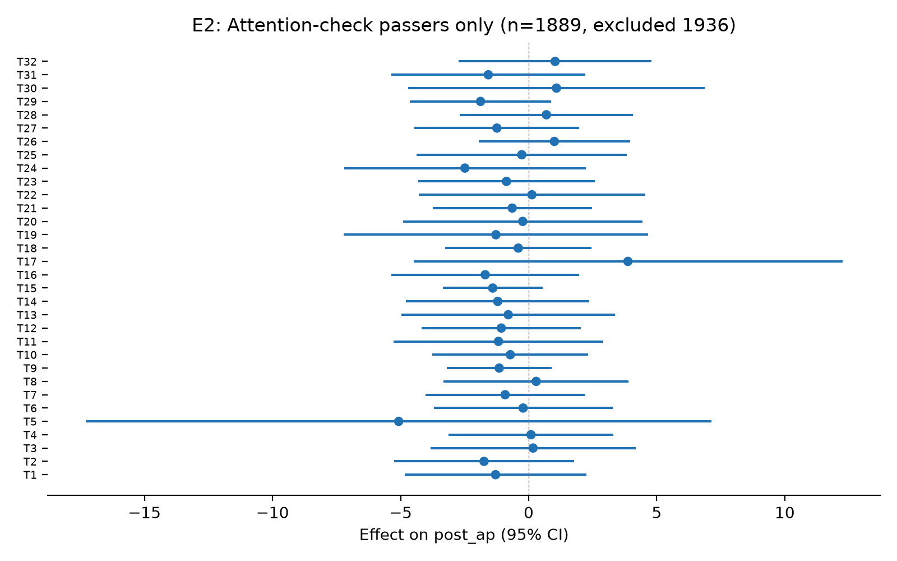

# Testing 33 Student-Designed Interventions to Reduce Affective Polarization

*Yamil Velez | 2026-10-01 | N = 3,825 analysed of 6,086 collected | survey experiment*

> **Provenance: FULLY AGENTIC — no human review recorded.** Generated by filedrawer 0.1.0 on 2026-10-01 with openrouter (orchestrator `anthropic/claude-sonnet-5.5`, standard `qwen/qwen3.8-27b`, zero data retention requested). Reviewer pass: no. Human steps recorded: 0. Release status: released.
>
> **No pre-registration. The analysis plan was reconstructed after data collection (2026-10-01) from the original analysis behind the published results.** Every test below is post hoc or exploratory.

## Key findings

- The pooled effect of 32 interventions on affective polarization was −0.82 points (95% CI [−1.39, −0.25], p = .005), a small average reduction.
- The perception-gap video lowered affective polarization by 2.33 points (95% CI [−4.28, −0.38], p = .019), the only arm reaching conventional significance.
- No intervention significantly changed support for undemocratic practices; the pooled estimate was −0.015 (95% CI [−0.044, +0.014], p = .309).
- The perception-gap video effect was concentrated among Democrats (−2.91 points, p = .012) but not distinguishable from zero for Republicans (−1.41, p = .412).
- All tests are post hoc with 32 uncorrected comparisons per outcome; the perception-gap video effect was no longer significant after excluding low-knowledge respondents, which also halves the sample.

## Summary

We tested 32 student-designed interventions against a control condition in a US online panel survey experiment (N = 3,825 finished partisan respondents in the primary analysis; control group n = 229). The primary outcome was affective polarization measured by a feeling-thermometer composite; the secondary outcome was support for undemocratic practices on a 1-to-7 scale. Pooled across all 32 arms, the average effect on affective polarization was a 0.82-point reduction (95% CI [−1.39, −0.25], p = .005). One arm, the perception-gap video, produced a statistically significant 2.33-point reduction (95% CI [−4.28, −0.38], p = .019). No arm significantly affected support for undemocratic practices. The study was not pre-registered; all tests are post hoc and uncorrected for multiple comparisons.

## Design and data

Design: survey experiment. Arms: `arm`: 32 treatment arms (T1 = Cooperation infographic, T2 = Bipartisan bills graph, T3 = Bipartisan elite quotes, T4 = Shared values exercise, T5 = Cross-partisan dialogue guide, T6 = Meta-dehumanization correction, T7 = Perception survey (form), T8 = Common-ground articles, T9 = Patriotic article, T10 = 14th Amendment video, T11 = Congressional softball video, T12 = iSideWith quiz, T13 = Rick and Morty perspective-taking, T14 = Brené Brown empathy video, T15 = Perception gap video, T16 = 'What makes an American' video, T17 = McCain defends Obama video, T18 = Egyptian revolution video, T19 = Cross-partisan friendship TED talk, T20 = American history video, T21 = Party-tailored videos, T22 = Jubilee free speech panel, T23 = Jubilee video, T24 = Media-profits-from-division image, T25 = Shared priorities (Pew) table, T26 = Bipartisan legislation examples, T27 = Common threat (Russia), T28 = Pro-democracy excerpt, T29 = Biden–DeSantis cooperation, T30 = Scandals, both parties (labeled), T31 = Scandals (labels revealed later), T32 = Perception gap quiz) vs control T0 = Control. Population: online_panel, US.

Sample: 6,086 raw responses; 3,956 finished partisan respondents after exclusions `Finished == 1; partisan in ['Democrat','Republican']; arm != 'T33'`; 3,825 with both thermometer measures (affective polarization) and 3,953 with both undemocratic-practices measures.

Analysis plan: author-supplied pap.json; registration: none. Identifier and free-text columns removed before any model saw the data: StartDate, EndDate, RecordedDate.

The study was not pre-registered; the analysis plan was reconstructed post hoc from the original analysis. 6,086 respondents were recruited from a US online panel (Lucid Theorem, November 2022); 3,956 finished partisan respondents remained after exclusions, yielding 3,825 in the affective-polarization model and 3,953 in the undemocratic-practices model. The control group contained 229 respondents. One arm (a GPT-3 chatbot) was excluded due to technical failures, leaving 32 treatment arms. Models included pre-treatment affective polarization as a covariate and used inverse-probability weights with HC2 standard errors.

## Results

### H1. Affective polarization after treatment

*Each intervention changes post_ap relative to control.*  
*Post hoc, not pre-registered.*

32 treatment arms are compared with control (Control) in one model on Affective polarization after treatment.


The pooled random-effects estimate across 32 arms was −0.82 points on the feeling-thermometer composite (95% CI [−1.39, −0.25], p = .005, two-sided). The perception-gap video was the only arm reaching conventional significance: −2.33 points (95% CI [−4.28, −0.38], p = .019). The 'What makes an American' video showed a point estimate of −2.65 points but was not distinguishable from zero (95% CI [−5.40, +0.10], p = .059). The remaining 30 arms were within roughly ±3 points of control and not individually significant. Because 32 comparisons were made without correction, the single significant result should be interpreted cautiously.

Pooled across 32 arms (random effects): -0.819, SE 0.291, p = 0.005, tau2 = 0.0000, I2 = 0.00. Caveat: the arm effects share one control group, so they are not independent; the random-effects pooling treats them as if they were, and its standard error and heterogeneity statistics are approximate.

```
post_ap ~ C(arm_code, Treatment(reference='T0')) + pre_ap
OLS | weights = ipw_weight | HC2 robust SEs | N = 3825 | two-sided test, alpha = 0.05
```

| Arm | Estimate | SE | p | 95% CI | n (arm) | Supported |
|---|---|---|---|---|---|---|
| Cooperation infographic | -1.153 | 1.592 | 0.4690 | [-4.273, 1.968] | 90 | no |
| Bipartisan bills graph | 0.377 | 1.522 | 0.8044 | [-2.607, 3.361] | 106 | no |
| Bipartisan elite quotes | -0.152 | 1.470 | 0.9179 | [-3.032, 2.729] | 94 | no |
| Shared values exercise | 0.860 | 1.690 | 0.6110 | [-2.453, 4.173] | 78 | no |
| Cross-partisan dialogue guide | -1.760 | 3.204 | 0.5827 | [-8.039, 4.519] | 68 | no |
| Meta-dehumanization correction | -0.024 | 1.633 | 0.9885 | [-3.225, 3.178] | 221 | no |
| Perception survey (form) | 0.172 | 1.743 | 0.9212 | [-3.243, 3.588] | 85 | no |
| Common-ground articles | -1.627 | 1.868 | 0.3837 | [-5.288, 2.034] | 67 | no |
| Patriotic article | -2.101 | 1.277 | 0.0999 | [-4.604, 0.402] | 330 | no |
| 14th Amendment video | -1.562 | 1.494 | 0.2960 | [-4.490, 1.367] | 62 | no |
| Congressional softball video | -2.437 | 1.954 | 0.2124 | [-6.268, 1.393] | 64 | no |
| iSideWith quiz | 0.357 | 1.304 | 0.7843 | [-2.198, 2.912] | 65 | no |
| Rick and Morty perspective-taking | -0.968 | 1.540 | 0.5297 | [-3.987, 2.051] | 58 | no |
| Brené Brown empathy video | -2.181 | 1.594 | 0.1714 | [-5.306, 0.944] | 163 | no |
| Perception gap video | -2.333 | 0.995 | 0.0191 | [-4.283, -0.382] | 641 | yes |
| 'What makes an American' video | -2.647 | 1.403 | 0.0592 | [-5.397, 0.102] | 149 | no |
| McCain defends Obama video | -0.689 | 2.592 | 0.7903 | [-5.769, 4.391] | 88 | no |
| Egyptian revolution video | -0.181 | 2.478 | 0.9416 | [-5.039, 4.676] | 72 | no |
| Cross-partisan friendship TED talk | 0.756 | 1.978 | 0.7024 | [-3.122, 4.633] | 71 | no |
| American history video | 1.311 | 2.277 | 0.5649 | [-3.153, 5.774] | 66 | no |
| Party-tailored videos | 0.838 | 1.581 | 0.5963 | [-2.262, 3.937] | 72 | no |
| Jubilee free speech panel | -1.875 | 2.151 | 0.3832 | [-6.090, 2.339] | 48 | no |
| Jubilee video | 0.098 | 2.068 | 0.9624 | [-3.955, 4.151] | 121 | no |
| Media-profits-from-division image | -2.629 | 2.097 | 0.2101 | [-6.740, 1.482] | 100 | no |
| Shared priorities (Pew) table | -0.088 | 1.480 | 0.9524 | [-2.989, 2.812] | 66 | no |
| Bipartisan legislation examples | 0.895 | 1.706 | 0.5998 | [-2.448, 4.238] | 68 | no |
| Common threat (Russia) | -0.961 | 1.765 | 0.5860 | [-4.419, 2.497] | 76 | no |
| Pro-democracy excerpt | -0.579 | 1.473 | 0.6940 | [-3.466, 2.307] | 60 | no |
| Biden–DeSantis cooperation | -0.734 | 1.277 | 0.5654 | [-3.237, 1.769] | 77 | no |
| Scandals, both parties (labeled) | -0.391 | 1.782 | 0.8265 | [-3.884, 3.102] | 140 | no |
| Scandals (labels revealed later) | -1.395 | 1.677 | 0.4053 | [-4.682, 1.891] | 73 | no |
| Perception gap quiz | 0.498 | 2.671 | 0.8521 | [-4.736, 5.732] | 57 | no |

### H2. Support for undemocratic practices

*Each intervention changes post_udp relative to control.*  
*Post hoc, not pre-registered.*

32 treatment arms are compared with control (Control) in one model on Support for undemocratic practices.


No arm produced a statistically significant change in support for undemocratic practices. The pooled estimate across 32 arms was −0.015 (95% CI [−0.044, +0.014], p = .309, two-sided). Individual arm estimates ranged from −0.156 (Pro-democracy excerpt) to +0.145 (Media-profits-from-division image), all with confidence intervals spanning zero; the largest positive estimates (Media-profits-from-division image, +0.145, p = .155; McCain defends Obama video, +0.144, p = .082) were not distinguishable from zero. On this outcome, none of the 32 interventions showed evidence of a meaningful effect.

Pooled across 32 arms (random effects): -0.015, SE 0.015, p = 0.309, tau2 = 0.0000, I2 = 0.00. Caveat: the arm effects share one control group, so they are not independent; the random-effects pooling treats them as if they were, and its standard error and heterogeneity statistics are approximate.

```
post_udp ~ C(arm_code, Treatment(reference='T0')) + pre_udp
OLS | weights = ipw_weight | HC2 robust SEs | N = 3953 | two-sided test, alpha = 0.05
```

| Arm | Estimate | SE | p | 95% CI | n (arm) | Supported |
|---|---|---|---|---|---|---|
| Cooperation infographic | 0.048 | 0.082 | 0.5579 | [-0.113, 0.209] | 94 | no |
| Bipartisan bills graph | 0.046 | 0.075 | 0.5415 | [-0.102, 0.194] | 110 | no |
| Bipartisan elite quotes | -0.115 | 0.088 | 0.1917 | [-0.289, 0.058] | 96 | no |
| Shared values exercise | -0.076 | 0.088 | 0.3859 | [-0.248, 0.096] | 81 | no |
| Cross-partisan dialogue guide | -0.125 | 0.088 | 0.1572 | [-0.298, 0.048] | 71 | no |
| Meta-dehumanization correction | -0.038 | 0.063 | 0.5431 | [-0.162, 0.085] | 227 | no |
| Perception survey (form) | 0.090 | 0.089 | 0.3122 | [-0.085, 0.266] | 88 | no |
| Common-ground articles | 0.029 | 0.119 | 0.8076 | [-0.205, 0.263] | 68 | no |
| Patriotic article | -0.058 | 0.058 | 0.3202 | [-0.172, 0.056] | 339 | no |
| 14th Amendment video | -0.086 | 0.075 | 0.2476 | [-0.233, 0.060] | 62 | no |
| Congressional softball video | 0.038 | 0.086 | 0.6568 | [-0.130, 0.206] | 65 | no |
| iSideWith quiz | -0.018 | 0.085 | 0.8289 | [-0.185, 0.148] | 67 | no |
| Rick and Morty perspective-taking | -0.063 | 0.090 | 0.4891 | [-0.240, 0.115] | 61 | no |
| Brené Brown empathy video | -0.071 | 0.073 | 0.3294 | [-0.215, 0.072] | 171 | no |
| Perception gap video | -0.006 | 0.054 | 0.9089 | [-0.113, 0.100] | 662 | no |
| 'What makes an American' video | 0.058 | 0.074 | 0.4287 | [-0.086, 0.203] | 156 | no |
| McCain defends Obama video | 0.144 | 0.083 | 0.0817 | [-0.018, 0.306] | 88 | no |
| Egyptian revolution video | -0.006 | 0.079 | 0.9437 | [-0.161, 0.150] | 74 | no |
| Cross-partisan friendship TED talk | 0.034 | 0.105 | 0.7454 | [-0.172, 0.240] | 72 | no |
| American history video | -0.065 | 0.080 | 0.4176 | [-0.222, 0.092] | 67 | no |
| Party-tailored videos | -0.116 | 0.124 | 0.3481 | [-0.358, 0.126] | 72 | no |
| Jubilee free speech panel | -0.051 | 0.101 | 0.6129 | [-0.249, 0.147] | 51 | no |
| Jubilee video | -0.003 | 0.073 | 0.9689 | [-0.145, 0.139] | 124 | no |
| Media-profits-from-division image | 0.145 | 0.102 | 0.1551 | [-0.055, 0.344] | 106 | no |
| Shared priorities (Pew) table | -0.008 | 0.100 | 0.9332 | [-0.205, 0.188] | 69 | no |
| Bipartisan legislation examples | -0.030 | 0.085 | 0.7254 | [-0.196, 0.137] | 70 | no |
| Common threat (Russia) | 0.034 | 0.089 | 0.7049 | [-0.141, 0.208] | 81 | no |
| Pro-democracy excerpt | -0.156 | 0.126 | 0.2150 | [-0.404, 0.091] | 60 | no |
| Biden–DeSantis cooperation | -0.092 | 0.107 | 0.3892 | [-0.303, 0.118] | 81 | no |
| Scandals, both parties (labeled) | -0.007 | 0.082 | 0.9355 | [-0.167, 0.154] | 144 | no |
| Scandals (labels revealed later) | -0.019 | 0.084 | 0.8166 | [-0.183, 0.145] | 78 | no |
| Perception gap quiz | 0.032 | 0.104 | 0.7569 | [-0.172, 0.236] | 58 | no |


## Exploratory analyses

*Everything in this section is exploratory and was not pre-registered.*

### E1. Heterogeneity by party for T15 (perception-gap video)

T15 was the only arm with a significant registered effect on post_ap (p=.019); testing whether the effect differs by party identity helps interpret the mechanism.

Method: WLS (HC2) of post_ap ~ arm + pre_ap separately for Democrats and Republicans, plus an interaction model (is_t15 × is_rep).

**Finding.** The T15 effect is concentrated among Democrats (β=−2.91, p=.012) but not Republicans (β=−1.41, p=.412); the interaction is not significant (p=.504).


The perception-gap video effect was larger among Democrats (−2.91 points, 95% CI [−5.18, −0.64], p = .012) than Republicans (−1.41, 95% CI [−4.79, +1.96], p = .412), but the interaction was not significant (p = .504).

| party | estimate | std_error | p_value | conf_low | conf_high | n |
|---|---|---|---|---|---|---|
| Democrat | -2.909 | 1.159 | 0.012 | -5.180 | -0.638 | 541 |
| Republican | -1.414 | 1.723 | 0.412 | -4.791 | 1.963 | 329 |
| Interaction (T15 x Republican) | 1.406 | 2.104 | 0.504 | -2.717 | 5.529 | 870 |

### E2. Robustness to excluding low-knowledge respondents

Excluding respondents who answered 2 or more of 3 political knowledge questions incorrectly tests whether the effects hold among more politically knowledgeable respondents.

Method: WLS (HC2) of post_ap ~ arm + pre_ap restricted to respondents with ≤1 wrong knowledge answer (n=1,889; 1,936 excluded).

**Finding.** After excluding 1,936 low-knowledge respondents (about half the sample), no arm reaches p < .05 on affective polarization; the perception-gap video estimate shrinks to −1.40 (p = .158). With half the sample, this check has much less power, so it does not show the effect was spurious.



Political knowledge is not a measure of attention, and the reduced sample is much less powered, so this check is inconclusive about the perception-gap video result.

| arm_code | estimate | std_error | p_value | conf_low | conf_high |
|---|---|---|---|---|---|
| T1 | -1.293 | 1.805 | 0.474 | -4.830 | 2.244 |
| T2 | -1.744 | 1.795 | 0.331 | -5.262 | 1.775 |
| T3 | 0.171 | 2.044 | 0.933 | -3.836 | 4.178 |
| T4 | 0.090 | 1.646 | 0.957 | -3.137 | 3.316 |
| T5 | -5.075 | 6.234 | 0.416 | -17.293 | 7.144 |
| T6 | -0.218 | 1.782 | 0.903 | -3.710 | 3.274 |
| T7 | -0.918 | 1.587 | 0.563 | -4.029 | 2.192 |
| T8 | 0.294 | 1.842 | 0.873 | -3.317 | 3.904 |
| T9 | -1.149 | 1.039 | 0.269 | -3.186 | 0.887 |
| T10 | -0.718 | 1.554 | 0.644 | -3.763 | 2.328 |
| T11 | -1.179 | 2.090 | 0.573 | -5.274 | 2.917 |
| T12 | -1.068 | 1.587 | 0.501 | -4.178 | 2.041 |
| … 20 more rows |  | | | | |

### E3. Component feeling-thermometer items for T15

Decomposing the composite post_ap into its two component items reveals whether T15 works by increasing in-party warmth or decreasing out-party warmth.

Method: WLS (HC2) of each component (post_ap_scores_1, post_ap_scores_2) ~ arm + pre_ap for T0 vs T15.

**Finding.** Neither component item is individually significant (item 1: β=−0.45, p=.860; item 2: β=+2.94, p=.230), indicating the composite T15 effect is not driven by a single thermometer item.

Neither component thermometer item was individually significant for the perception-gap video (item 1: −0.45, p = .860; item 2: +2.94, p = .230), so the composite effect is not attributable to a single item.

| component | estimate | std_error | p_value | conf_low | conf_high | n |
|---|---|---|---|---|---|---|
| post_ap_scores_1 | -0.446 | 2.521 | 0.860 | -5.388 | 4.496 | 870 |
| post_ap_scores_2 | 2.939 | 2.448 | 0.230 | -1.860 | 7.737 | 870 |

## Silicon-sampling replication

*Exploratory. LLM personas are not evidence about humans.*

_Skipped: silicon sampling skipped._

## Related findings

_Not available: skipped by flag._

## Limitations

The study was not pre-registered; every test is post hoc. Thirty-two arms were tested per outcome without multiplicity correction, inflating the family-wise error rate. The perception-gap video effect was not significant among high-knowledge respondents alone, though that subsample is about half the size. Arm sizes varied widely (48 to 641 for affective polarization; 51 to 662 for undemocratic practices), limiting power for smaller arms. The control group (n = 229) is shared across all 32 comparisons, which induces correlation among arm estimates and complicates interpretation of the pooled result. Findings are from a US online panel and may not generalize to other populations.

## Plan fidelity

Tags compare the registered and implemented specifications field by field; they are not self-reported.

| Analysis | Tag | Registered | Implemented | Justification |
|---|---|---|---|---|
| H1 | **unregistered** | as planned | as planned |  |
| H2 | **unregistered** | as planned | as planned |  |

Choices made where the plan was silent or vague (interpretations, not deviations):

- H1 / outcomes.post_ap: "post_ap, affective polarization after treatment = in-party minus out-party feeling thermometer" -> Used the precomputed post_ap column (Derived column exists in the data)

## Reproduction

From the study folder:

```bash
python scripts/02_clean.py && python scripts/03_registered.py
python scripts/04_exploratory.py   # if present
filedrawer reproduce .             # re-runs everything and checks every results table is byte-identical
```

Data files (not included in this repository; respondent-level data are available from the author): `data/raw_tidy.csv` (tidy export, identifiers removed), `data/clean.csv` (analysis sample with constructed outcomes), `codebook.md` (from the survey schema), `pap.json` (machine-readable analysis plan). See `RUN.md`.

## Files

- `.gitignore`
- `RUN.md`
- `codebook.json`
- `codebook.md`
- `data/clean.csv`
- `data/raw_tidy.csv`
- `figures/E1_party_heterogeneity.png`
- `figures/E2_attention_check.png`
- `figures/H1_arms.png`
- `figures/H2_arms.png`
- `figures/registered_effects.png`
- `pap.json`
- `pap.md`
- `provenance/literature.json`
- `provenance/llm_log.jsonl`
- `provenance/provenance.json`
- `report.md`
- `results/E1_party_heterogeneity.csv`
- `results/E2_attention_check_robustness.csv`
- `results/E3_component_items.csv`
- `results/H1.csv`
- `results/H1_arms.csv`
- `results/H2.csv`
- `results/H2_arms.csv`
- `results/analysis_tags.csv`
- `results/registered_summary.csv`
- `scripts/01_tidy.py`
- `scripts/02_clean.py`
- `scripts/03_registered.py`
- `scripts/04_exploratory.py`
- `study.json`
- `survey.qsf`
